# Urban Data Scraper — Workshop Guide
### Building AI-Assisted Data Scrapers for Urban Research

> **Duration:** 1 hour 30 minutes  
> **Level:** Intermediate (Python familiarity assumed)  
> **Outcome:** Students understand the scraper architecture end-to-end and can prompt an AI coding assistant to build their own data pipeline for any web source.

---

## Get the Workshop Package

```bash
# 1. Clone this repository
git clone https://github.com/kdanielyu/CODE1210_Scrape_Workshop.git
cd CODE1210_Scrape_Workshop

# 2. Launch the app — installs dependencies, creates .env + data/, opens the dashboard
python3 run.py
```

`run.py` is a one-command launcher. It checks your Python version (3.10+), **creates an isolated virtual environment (`.venv`) and installs everything there** — so it works even when your system Python is "externally managed" (the error you get with Homebrew Python on macOS or `apt` Python on Debian/Ubuntu). It then creates a local `data/` folder, copies `.env.example` to `.env` if needed, and starts the Streamlit dashboard at **http://localhost:8501**. Add your `GOOGLE_MAPS_API_KEY` to the `.env` file before scraping (full walkthrough in **Part 2 — Setup**).

> **No manual `pip install` needed.** Running `pip install ...` against the system Python is exactly what triggers the `externally-managed-environment` error. Just run `python3 run.py` and let it handle the virtual environment for you.

| Command | What it does |
|---------|--------------|
| `python3 run.py` | Create `.venv` (if needed), install dependencies, start the dashboard |
| `python3 run.py --install` | Set up `.venv` + install dependencies only, then exit |
| `python3 run.py --no-install` | Skip the dependency check and launch immediately |
| `python3 run.py --no-venv` | Use your currently active Python / conda env instead of `.venv` |

> **Looking for the technical reference?** The full architecture, database schema, and developer docs live in [`docs/PROJECT.md`](docs/PROJECT.md).

---

## Workshop Timeline

| Time | Segment | Duration |
|------|---------|----------|
| 0:00 | Welcome & Objectives | 5 min |
| 0:05 | Setup Part 1 — Google Maps API Registration | 10 min |
| 0:15 | Setup Part 2 — Local Deployment | 10 min |
| 0:25 | Dashboard Tour — The Streamlit UI | 15 min |
| 0:40 | Scraper Architecture Deep Dive | 20 min |
| 1:00 | Building Your Own Scraper with AI Prompts | 20 min |
| 1:20 | Bonus — Reddit Scraper Extension | 10 min |

---

## Part 1 — Welcome & Objectives (0:00 – 0:05)

### What is Urban Data Scraper?

Urban Data Scraper is a self-contained research tool that collects, stores, and visualises urban place data and community discussions. It runs entirely on your laptop — no cloud, no separate server, no database administration.

**What it does:**

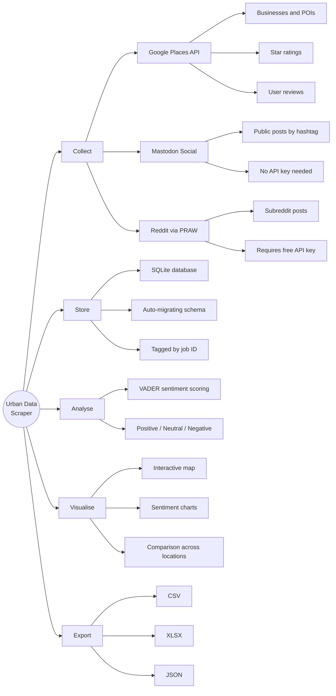

### Learning Objectives

By the end of this workshop you will be able to:

1. Deploy the scraper on your own machine with a live Google Maps API key
2. Read and explain the modular scraper architecture
3. Write precise technical prompts that give an AI enough context to build a new scraper
4. Activate the Reddit scraper template using your own free API credentials

---

## Part 2 — Setup: Google Maps API Registration (0:05 – 0:15)

> **Why first?** Google's API key can take a few minutes to activate. Starting registration now means it will be ready by the time we reach the deployment step.

### Step-by-step: Create a Google Maps API Key

**2.1 — Create a Google Cloud project**

1. Open [console.cloud.google.com](https://console.cloud.google.com)
2. Click the project drop-down at the top → **New Project**
3. Name it something like `urban-data-scraper` → **Create**
4. Wait ~30 seconds for the project to be provisioned

**2.2 — Enable the required APIs**

In the left sidebar: **APIs & Services → Library**

Search for and enable each of these:

| API | Purpose |
|-----|---------|
| **Places API** | Search for businesses and POIs by location |
| **Geocoding API** | Convert suburb names to lat/lng coordinates |
| **Maps JavaScript API** | Optional — only needed if you extend the map UI |

> Enable Places API and Geocoding API at minimum. Each takes ~10 seconds.

**2.3 — Create an API Key**

1. Go to **APIs & Services → Credentials**
2. Click **+ Create Credentials → API key**
3. Copy the key immediately — you will need it in the next step
4. (Optional but recommended) Click **Edit API key → API restrictions** and restrict it to the three APIs above

**2.4 — Billing**

Google gives **$200 free credit per month**. A typical scrape covering a 1.5 km radius costs less than $1. You will not be charged for workshop usage.

> **Note:** You do need a credit card on file to activate the free tier. If this is a concern, you can share a key with a partner for the workshop.

---

## Part 3 — Setup: Local Deployment (0:15 – 0:25)

### Prerequisites

- Python 3.10 or newer (check: `python3 --version`)
- The project folder on your machine — either `git clone` it (see [Get the Workshop Package](#get-the-workshop-package)) or unzip the download

### Step-by-step Deployment

**3.1 — Open a terminal in the project folder**

```bash
cd CODE1210_Scrape_Workshop
```

**3.2 — Configure your API key**

```bash
cp .env.example .env
```

Open `.env` in any text editor and paste your key:

```ini
GOOGLE_MAPS_API_KEY=AIzaSy...your_key_here

# Leave these blank for now — we'll come back to them in the Reddit section
REDDIT_CLIENT_ID=
REDDIT_CLIENT_SECRET=
REDDIT_USER_AGENT=
```

**3.3 — Launch**

```bash
python3 run.py
```

`run.py` is a smart launcher that does everything automatically:

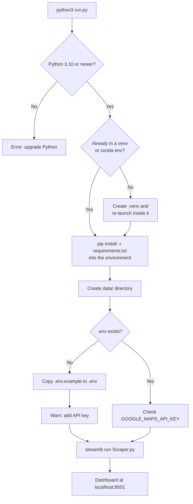

The dashboard opens automatically. If it doesn't, navigate to **http://localhost:8501** in your browser.

> **Why a virtual environment?** Modern macOS (Homebrew) and Linux (Debian/Ubuntu) mark the system Python as *externally managed*. Installing packages into it with `pip` is blocked and raises `error: externally-managed-environment`. `run.py` sidesteps this entirely by creating a project-local `.venv` and installing there — nothing is installed into your system Python.

### Troubleshooting

| Symptom | Fix |
|---------|-----|
| `error: externally-managed-environment` | Don't run `pip install` directly — just run `python3 run.py`. It installs into `.venv` automatically. |
| `python -m venv` fails on Linux (`ensurepip is not available`) | Install the venv package: `sudo apt install python3-venv`, then re-run `python3 run.py`. |
| You use Anaconda / your own venv | Activate it first, then run `python3 run.py` — it detects the active environment and installs there instead of creating `.venv`. (Or pass `--no-venv`.) |
| Dependencies look broken | Delete the `.venv/` folder and run `python3 run.py` again to rebuild it from scratch. |

To run other commands (e.g. `streamlit`, `python`) against the same dependencies later, activate the environment first:

```bash
# macOS / Linux
source .venv/bin/activate

# Windows (PowerShell)
.venv\Scripts\Activate.ps1
```

---

## Part 4 — Dashboard Tour (0:25 – 0:40)

The UI is a **Streamlit multipage application**. Every `.py` file in `pages/` is automatically added to the sidebar — no routing configuration needed.

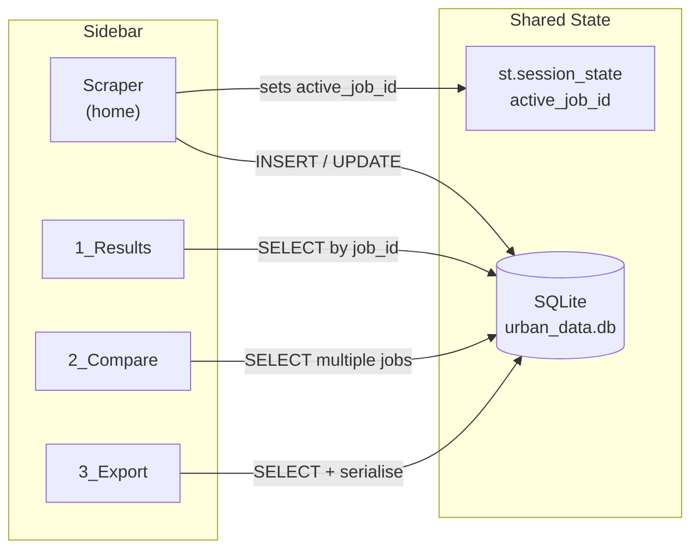

### Page-by-page Overview

| Page | What you do here | Key features to notice |
|------|-----------------|----------------------|
| **Scraper.py** | Launch a new scrape job | Location geocoding, source checkboxes, place type selector, live status card (polls every 2 s) |
| **1_Results.py** | Explore one completed job | Folium interactive map, sentiment pie chart, per-source data tabs, filterable tables |
| **2_Compare.py** | Benchmark multiple locations | Side-by-side bar charts for volume, rating, and sentiment mix |
| **3_Export.py** | Download your data | CSV / XLSX / JSON export, multi-job selection |

### Run Your First Scrape (live demo)

1. Go to the **Scraper** home page
2. Enter a location, e.g. `Newtown, Sydney NSW`
3. Set radius to `1000 m`, leave max results at `50`
4. Tick **Google Places** and **Mastodon**
5. Click **Start Scraping**
6. Watch the status card update in real time → `pending → running → completed`
7. Click **View Results** when done

---

## Part 5 — Scraper Architecture Deep Dive (0:40 – 1:00)

This is the core technical section. Understanding this architecture is what lets you build new scrapers efficiently — whether by hand or with AI assistance.

### 5.1 — The Big Picture

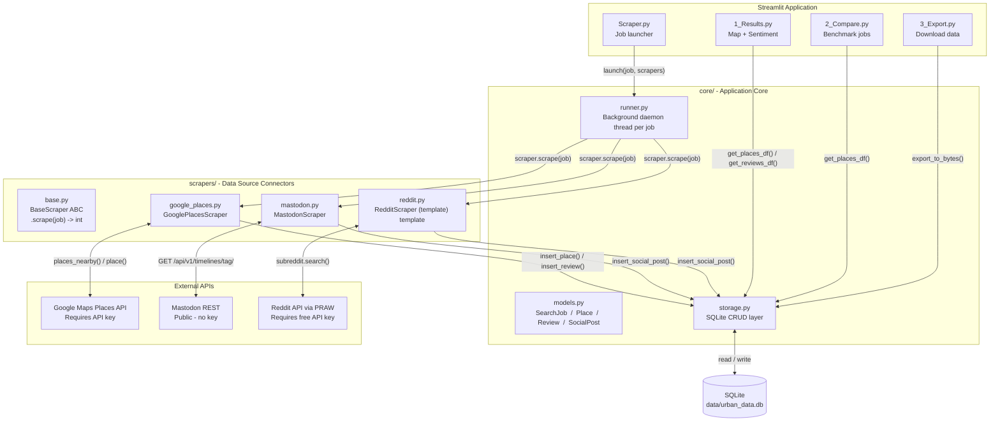

### 5.2 — The Job Lifecycle

Every scrape starts as a `SearchJob` — a Python dataclass that carries all parameters the user sets in the UI.

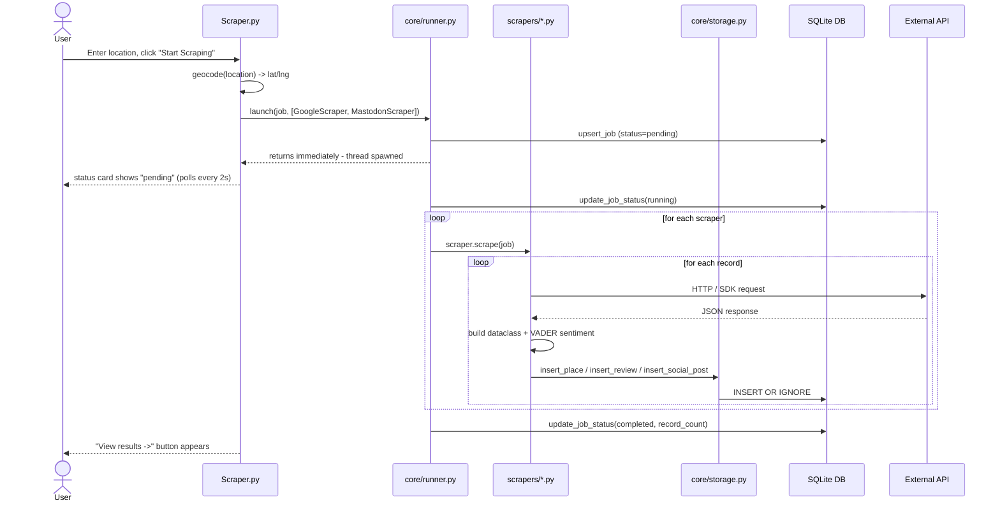

### 5.3 — Job Status State Machine

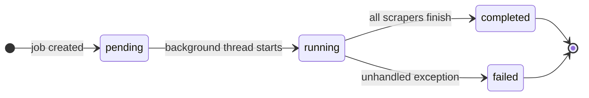

The home page polls `storage.get_job(id)` every 2 seconds using Streamlit's `@st.fragment(run_every=2)` decorator. This keeps the UI responsive without blocking the main thread.

### 5.4 — The Scraper Contract: `BaseScraper`

Every data source connector inherits from a single abstract base class. This is the "contract" that keeps the system pluggable:

```python
# scrapers/base.py
class BaseScraper(ABC):
    name: str = "base"          # identifies the source in the database

    @abstractmethod
    def scrape(self, job: SearchJob) -> int:
        """Execute scraping for *job*. Returns number of records inserted."""

    def __call__(self, job: SearchJob) -> int:
        return self.scrape(job)
```

**The only rule:** implement `scrape(job)` and return the record count. Everything else is your choice.

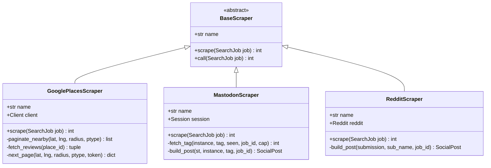

### 5.5 — Data Models

Scrapers write to the database through three dataclasses. Choose the right one for your data source:

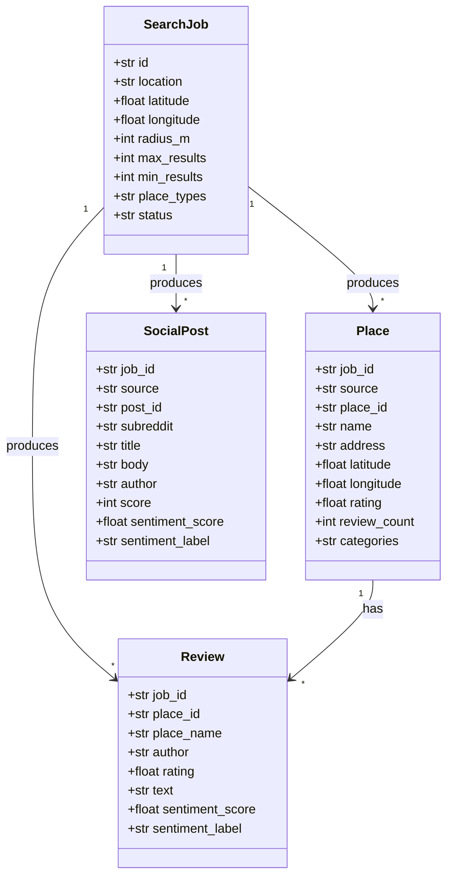

**Decision guide:**
- Building a scraper for a physical venue or business? → `Place` + `Review`
- Building a scraper for a social platform, forum, or news feed? → `SocialPost`

### 5.6 — Google Places Scraper: How It Works

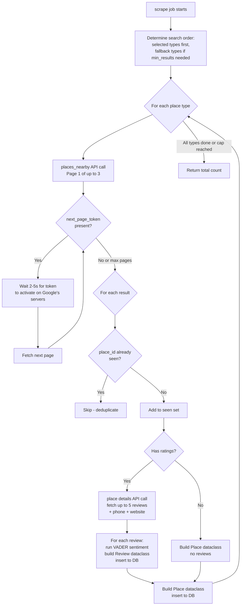

**Key design decisions to notice:**
- **Deduplication by `place_id`**: The same venue can appear in multiple place type searches. The `seen_place_ids` set prevents double-counting.
- **Pagination with retry**: Google's `next_page_token` is not immediately valid — the scraper backs off with progressive delays (2s, 3s, 4s, 5s).
- **Fallback categories**: If `min_results` is set, the scraper exhausts primary categories and then searches fallback types until the target is met.

### 5.7 — Mastodon Scraper: How It Works

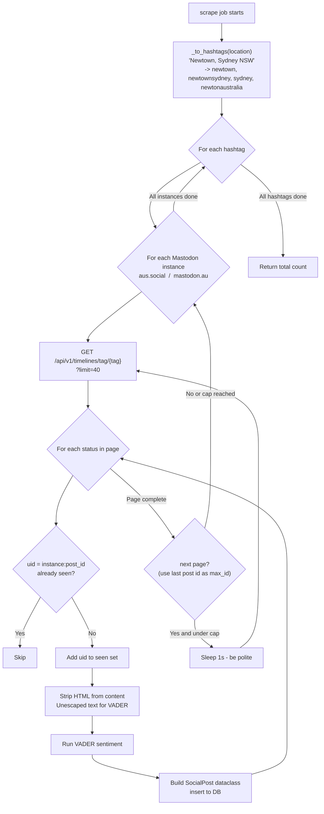

**Key design decisions:**
- **No authentication required**: Mastodon's public timeline API requires no keys.
- **Two instances**: `aus.social` and `mastodon.au` are searched to maximise Australian coverage.
- **Politeness sleep**: 1 second between pages respects the server's resources.

### 5.8 — Sentiment Analysis: VADER

Both active scrapers apply VADER (Valence Aware Dictionary and sEntiment Reasoner) — a rule-based model specifically designed for short social text.

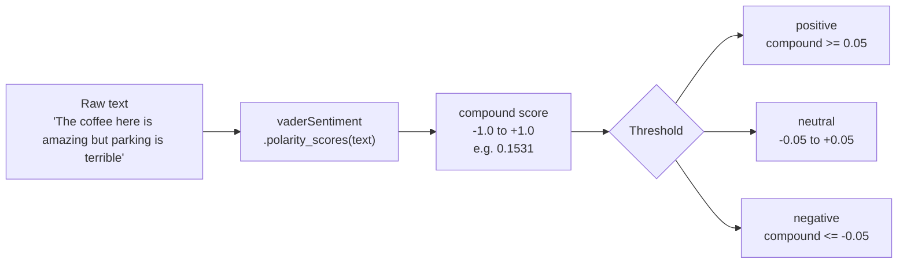

The compound score is stored in the database and drives the sentiment charts in the Results and Compare pages.

> **Know VADER's limits before you trust the numbers.** VADER is a fixed English lexicon tuned for short social-media text. It does **not** understand sarcasm ("Great, another 45-minute wait"), domain jargon, negation spread across clauses, or any non-English text, and it assigns a neutral score to anything it doesn't recognise. For research claims, treat VADER as a coarse first pass: describe it as "lexicon-based sentiment," hand-check a sample of the labels, and consider a transformer model (e.g. a HuggingFace `distilbert` sentiment model) when accuracy actually matters.

### 5.9 — Database Schema

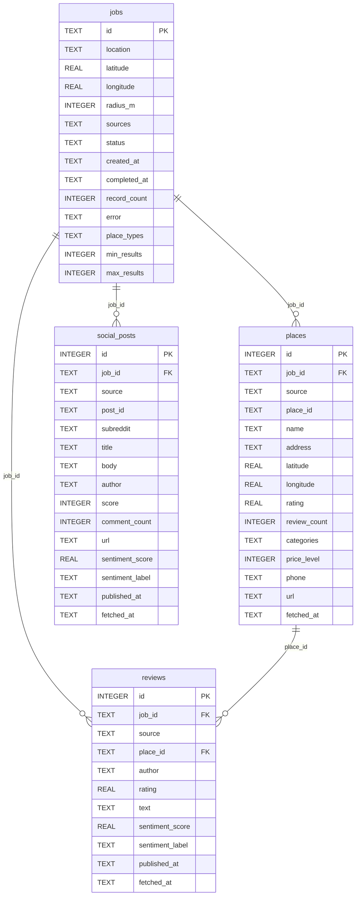

**Every row carries `job_id`**: this single design decision makes it trivial to isolate, compare, or delete any job's data.

---

## Part 6 — Building a Standalone Scraper with AI Prompts (1:00 – 1:20)

In this section we build a **standalone scraper** — a self-contained Python script that runs independently of the existing pipeline. It takes a location as input and writes a CSV file as output. This is the fastest way to get data quickly and is a transferable pattern for any research project.

> **Why standalone first?** The pipeline scraper you saw earlier adds complexity (abstract base class, storage layer, background threads). A standalone script is simpler to write, easier to debug, and can always be adapted into a pipeline scraper later.

---

### 6.1 — Anatomy of Any Scraper

Regardless of whether you're calling an API or scraping HTML, every scraper has the same six components. Understanding these components before you prompt an AI is what separates a working scraper from a pile of broken code.

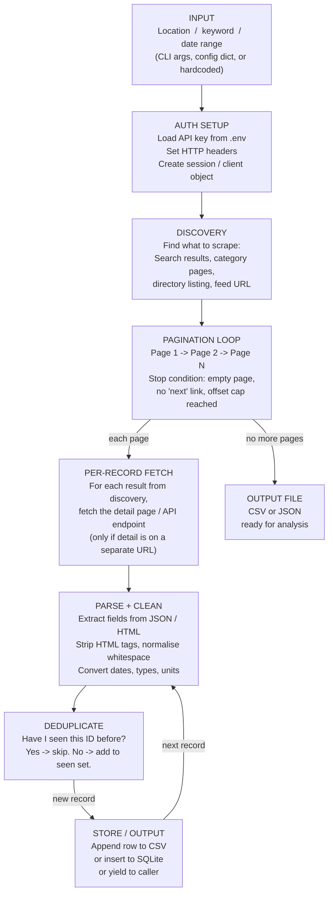

**The three most commonly misunderstood components:**

| Component | What goes wrong without it | Fix |
|-----------|--------------------------|-----|
| Pagination loop | Scraper only gets page 1, returns 20 results instead of 2000 | Always ask: "how does the URL or response change between pages?" |
| Deduplication | Same record appears 3× because it showed up in 3 category pages | Track a `seen: set[str]` of unique IDs |
| Per-record fetch | Scraper gets names and ratings from the list but misses review text on the detail page | Two-level loop: list page → detail page |

---

### 6.2 — Three Types of Web Data Sources

Before writing any code, you need to know which type of source you're dealing with. Each type requires a different approach and different libraries.

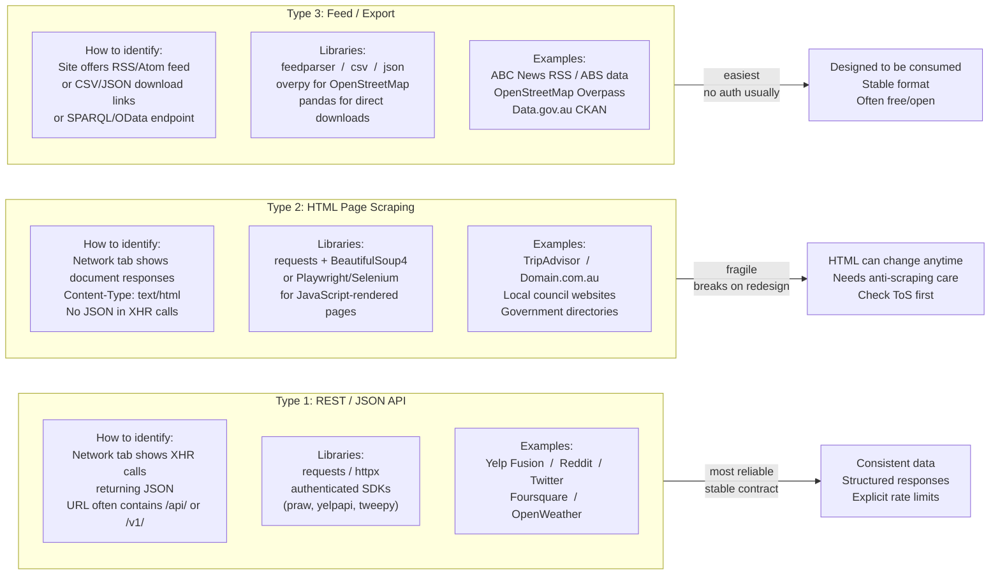

**How to tell which type you have — 60-second check:**

1. Open the target site in Chrome, open **DevTools → Network** tab
2. Filter by **XHR/Fetch**
3. Reload the page
4. If you see JSON responses → **Type 1 (API)**
5. If you see only HTML documents → **Type 2 (HTML)**
6. Look for a feed icon in the browser bar or `/rss`, `/feed`, `/api/data.csv` links → **Type 3**

---

### 6.3 — Things to Watch Out For

These are the failure modes that catch most students. Understanding them before prompting an AI means you can tell the AI exactly how to handle them.

#### Pagination Patterns

Not all pagination works the same way. The AI will get it wrong if you don't specify the exact pattern.

```mermaid
flowchart TB
    subgraph PN["Page Number<br/>e.g. ?page=1, ?page=2"]
        PN1["Increment page counter<br/>until response is empty<br/>or page exceeds max_pages"]
    end

    subgraph OS["Offset and Limit<br/>e.g. ?offset=0 limit=20<br/>?offset=20 limit=20"]
        OS1["offset += limit each iteration<br/>Stop when items returned is less than limit<br/>or offset exceeds total_count from response"]
    end

    subgraph CT["Cursor / Token<br/>e.g. ?after=eyJpZCI6MTIz<br/>or next_page_token from body"]
        CT1["Use cursor/token from previous response<br/>Stop when cursor is null or absent"]
    end

    subgraph LH["Link Header<br/>Link: url rel='next'"]
        LH1["Parse Link header from HTTP response<br/>Follow the 'next' URL<br/>Stop when no 'next' link present"]
    end

    subgraph URL["URL Path Segment<br/>e.g. /oa0/, /oa30/, /oa60/<br/>or /page-2/, /page-3/"]
        URL1["Embed offset in URL path<br/>Increment by fixed step<br/>Stop when page has 0 results"]
    end

    subgraph IS["Infinite Scroll<br/>JavaScript loads more on scroll"]
        IS1["Requires Playwright or Selenium<br/>Cannot use requests alone<br/>Look for underlying API call instead"]
    end
```

**Tell the AI which pattern applies. Example:**
- "This API uses offset-based pagination. Each response includes a `total` field. Loop offset from 0 in steps of 50 until `offset + 50 > total`."
- "The URL embeds the page offset as `/oa{n}/` where n increments by 30. Stop when the page contains no listing cards."
- "The response includes a `next_page_token` field. Pass it back as the `pageToken` parameter. Stop when the field is absent."

---

#### Multi-Page Directory Structure

Many sites you'll want to scrape are multi-level: a search/index page links to venue pages, which link to review pages. Each level is a separate HTTP request.

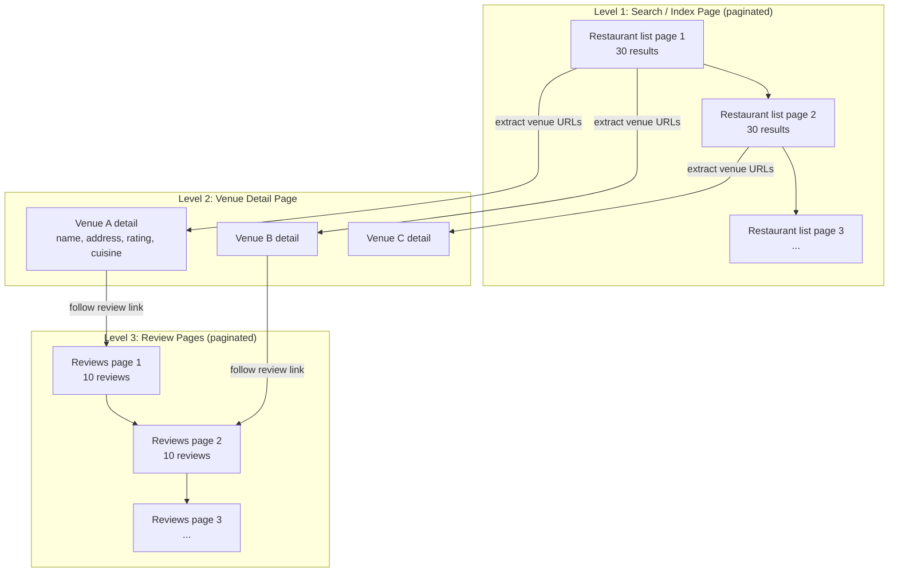

**Cost:** A 3-level scraper makes many more HTTP requests than a 1-level scraper. For 100 venues with 3 review pages each: `~100 search page requests + 100 detail requests + 300 review page requests = ~500 total requests`. At 2 seconds per request that is ~17 minutes of runtime.

**Tell the AI:** "This is a 2-level scraper. Level 1 is the search results page (paginated). For each result, fetch the detail page (Level 2) to get the full description and contact info. Do not attempt to paginate reviews — just take what's on the first review page."

---

#### Rate Limiting and Politeness

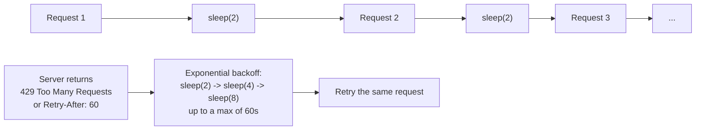

**What to tell the AI:**
- "Sleep 2 seconds between every request using `time.sleep(2)`."
- "If the response status is 429, read the `Retry-After` header and sleep that many seconds before retrying."
- "Use `random.uniform(1.5, 3.5)` for the sleep so the timing is less predictable."

---

#### Anti-Scraping Measures (HTML Sources)

Many websites actively block automated requests. You need to tell the AI what countermeasures to apply.

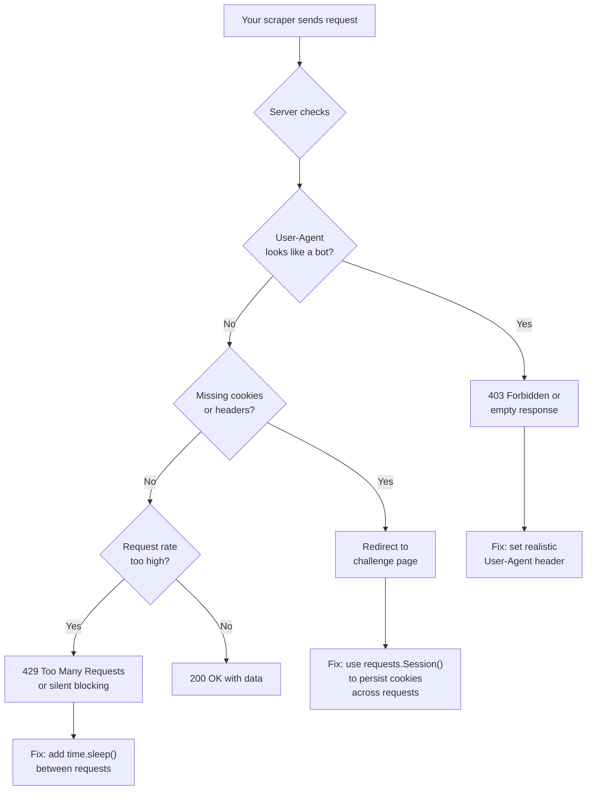

**Minimal headers to always include for HTML scraping:**

```python
headers = {
    "User-Agent": (
        "Mozilla/5.0 (Macintosh; Intel Mac OS X 10_15_7) "
        "AppleWebKit/537.36 (KHTML, like Gecko) "
        "Chrome/124.0.0.0 Safari/537.36"
    ),
    "Accept-Language": "en-AU,en;q=0.9",
    "Accept": "text/html,application/xhtml+xml,application/xml;q=0.9,*/*;q=0.8",
    "Referer": "https://www.google.com/",
}
session = requests.Session()
session.headers.update(headers)
```

> **Note on ethics and legality:** Always check `robots.txt` (e.g. `https://example.com/robots.txt`) and the site's terms of service before scraping. Many sites explicitly prohibit automated access. This workshop is for educational purposes — in a research context always use official APIs where available.

---

#### Deduplication

Without deduplication, the same record appears multiple times because a venue or post can appear in multiple category searches or on multiple listing pages.

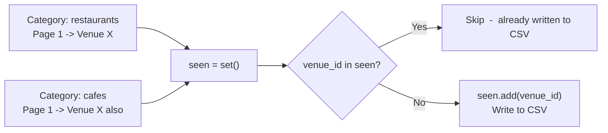

**What to tell the AI:** "Maintain a `seen: set[str]` of venue IDs. Before writing any row, check `if venue_id in seen: continue` then `seen.add(venue_id)`."

---

#### Develop Against a Local Cache (be fast, be polite)

While you iterate on your parser you will run the script dozens of times. **Do not re-download the same pages on every run** — it is slow and it hammers the server, which is a fast way to get blocked. Cache responses on the first fetch and read from disk afterwards.

The zero-dependency approach — save each raw response to a file and check for it before fetching:

```python
import hashlib, pathlib, requests

CACHE = pathlib.Path("cache"); CACHE.mkdir(exist_ok=True)

def get_cached(url: str, session: requests.Session) -> str:
    key = CACHE / (hashlib.sha256(url.encode()).hexdigest() + ".html")
    if key.exists():
        return key.read_text(encoding="utf-8")     # no network call
    resp = session.get(url, timeout=10)
    resp.raise_for_status()
    key.write_text(resp.text, encoding="utf-8")
    return resp.text
```

The drop-in library approach — `requests-cache` transparently caches every request:

```python
import requests_cache

# Cache all responses for 24 hours in a local SQLite file
session = requests_cache.CachedSession("scrape_cache", expire_after=86400)
resp = session.get(url)        # first call hits the network, later calls are instant
```

**What to tell the AI:** "During development, cache every HTTP response to a local folder keyed by a hash of the URL, and read from the cache if it exists before making a network request. Use `requests_cache.CachedSession` with a 24-hour expiry."

---

#### Data Validity: Your Scrape Is Not a Random Sample

This is the most important non-technical lesson in the workshop. Scraped data is **observational and self-selected**, not a random sample of the real world. Before drawing any research conclusion, ask what your source systematically over- or under-represents.

| Source | Systematic bias to declare |
|--------|---------------------------|
| Google Places / Yelp | Over-represents popular, rated, currently-open venues. Closed or un-reviewed businesses are invisible. |
| Reviews (any platform) | Self-selection toward extremes — people who loved it or hated it. The "silent middle" is missing. |
| Reddit / Mastodon | Skews young, urban, English-speaking, and digitally engaged. Not the population of a suburb. |
| Property portals | Show *asking* prices and *current* listings — not sale prices or the full housing stock. |

**What to do:** report your data honestly as "venues listed on Google Places in March 2026," not "venues in Newtown." State coverage limits explicitly, and where possible triangulate two independent sources.

---

#### Legal, Ethical & Research Governance

Collecting data is a technical act with legal and ethical consequences. For university research these are not optional.

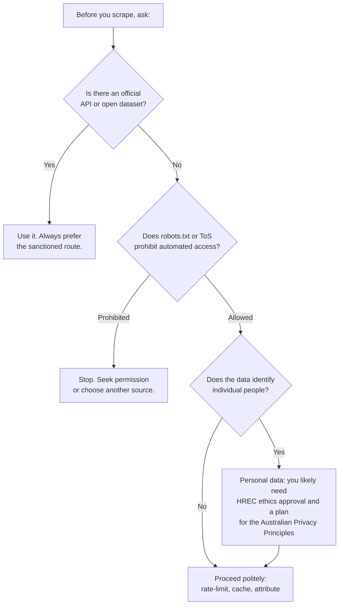

**Check `robots.txt` in code — don't just eyeball it:**

```python
import urllib.robotparser

rp = urllib.robotparser.RobotFileParser()
rp.set_url("https://example.com/robots.txt")
rp.read()

if not rp.can_fetch("ResearchScraper/1.0", "https://example.com/listings?page=2"):
    raise SystemExit("robots.txt disallows this path - do not scrape it.")

crawl_delay = rp.crawl_delay("ResearchScraper/1.0")   # honour it if present
```

**Governance checklist for a research scrape:**

| Concern | What to do |
|---------|-----------|
| **robots.txt** | Parse and honour `Disallow` and `Crawl-delay` programmatically (above). |
| **Terms of Service** | Read them. Many sites' ToS prohibit automated collection — this is a contract, independent of robots.txt. |
| **Personal data** | Reviews, posts, and usernames are personal information. Under the Australian Privacy Principles you must justify collection, store it securely, and minimise what you keep. |
| **Ethics approval (HREC)** | Research on identifiable human data (social posts, reviews) usually requires Human Research Ethics Committee approval *before* collection. Check with your supervisor. |
| **Attribution & licence** | Open datasets often require attribution (e.g. CC-BY, ABS, OpenStreetMap ODbL). Record the licence alongside the data. |
| **Data retention** | Decide up front how long you keep raw personal data and when you anonymise or aggregate it. |

> **Rule of thumb for this workshop:** prefer official APIs, never collect more personal data than your research question needs, identify yourself honestly in your User-Agent, and when in doubt, ask before you scrape.

---

### 6.4 — Deconstructing a Target Before Prompting

Before writing a single word of a prompt, spend 5 minutes answering these questions about your target. The answers go directly into your prompt.

```mermaid
flowchart TD
    A["Open target site<br/>in Chrome"] --> B["DevTools -> Network tab<br/>Filter: XHR/Fetch<br/>Reload the page"]
    B --> C{JSON responses<br/>in Network tab?}
    C -- Yes --> D["Type 1: REST API<br/>Note the endpoint URL<br/>Note the request headers<br/>Note the response JSON keys"]
    C -- No --> E["Type 2 or 3: HTML<br/>Use Elements tab to<br/>find CSS selectors"]
    D --> F["Click to the next page<br/>What changes in the URL<br/>or request body?"]
    E --> F
    F --> G["Identify pagination type:<br/>page number / offset /<br/>cursor / URL segment"]
    G --> H["Click into a detail page<br/>Does the URL change?<br/>(= multi-level scraper needed)"]
    H --> I["Check robots.txt<br/>https://site.com/robots.txt<br/>Any Disallow rules?"]
    I --> J["Note rate limits:<br/>API docs, or be conservative<br/>1 req/2s for HTML<br/>follow Retry-After for APIs"]
    J --> K["You now have all 7<br/>elements for your prompt"]
```

---

#### Shortcut: Replicate the Hidden JSON API (the most useful skill here)

Most "JavaScript-heavy" sites don't actually hide their data — they load it from an internal JSON endpoint that your browser calls in the background. If you can find that endpoint, you can call it directly with `requests` and skip Playwright entirely. This is faster, more stable, and far easier to prompt for.

```mermaid
flowchart LR
    A["DevTools -> Network<br/>Filter: Fetch/XHR"] --> B["Reload page,<br/>scroll, click 'next'"]
    B --> C["Find the request that<br/>returns the data as JSON"]
    C --> D["Right-click -> Copy -><br/>Copy as cURL"]
    D --> E["Paste into curlconverter.com<br/>or ask the AI to convert<br/>cURL to Python requests"]
    E --> F["Replicate the call directly:<br/>same URL, params, headers"]
```

**Worked example — an infinite-scroll listing page:**

1. You open a property or events page and see results load as you scroll. `requests.get(page_url)` returns an almost-empty `<div id="app">`.
2. Open **DevTools -> Network -> Fetch/XHR** and scroll once. You spot a call like
   `GET https://api.site.com/v2/listings?suburb=newtown&page=2&pageSize=20` returning clean JSON.
3. **Copy as cURL**, convert it, and now you have a simple 1-level API scraper instead of a browser-automation problem.

**What to tell the AI:**

```
I inspected the Network tab. The page loads its data from this internal JSON
endpoint (not from the HTML):
  GET https://api.site.com/v2/listings?suburb={suburb}&page={n}&pageSize=20
Required headers (copied from the browser request):
  Accept: application/json
  X-Api-Version: 2
  Referer: https://www.site.com/
The response is JSON shaped like { "total": 320, "results": [ {...} ] }.
Write a standalone scraper that calls this endpoint directly with requests
(do NOT use Selenium or Playwright). Paginate by incrementing page until
results is empty or page * pageSize >= total.
```

> If the internal request needs a token or cookie, copy it from the same Network request. If that token is short-lived and refuses to replay, that is the signal to fall back to Playwright (Appendix B).

---

### 6.5 — Prompt Anatomy: The 7 Elements

A prompt that generates working scraper code contains all seven of these elements. Missing even one usually produces code that has to be re-written.

```mermaid
flowchart LR
    ROOT(("7 Elements of a Good<br/>Scraper Prompt"))

    ROOT --> E1["1. Output Spec"]
    E1 --> E1a["File name pattern"]
    E1 --> E1b["Exact CSV columns or JSON keys"]
    E1 --> E1c["Encoding requirements"]

    ROOT --> E2["2. URL Structure"]
    E2 --> E2a["Exact URL pattern with placeholders"]
    E2 --> E2b["What each variable means"]
    E2 --> E2c["Example concrete URLs"]

    ROOT --> E3["3. Pagination Mechanism"]
    E3 --> E3a["Which of the 6 pagination types"]
    E3 --> E3b["What signals the last page"]
    E3 --> E3c["Any token activation delays"]

    ROOT --> E4["4. HTML Selectors or API Params"]
    E4 --> E4a["CSS selectors for each field"]
    E4 --> E4b["JSON key paths"]
    E4 --> E4c["Data-attribute names"]

    ROOT --> E5["5. Auth and Headers"]
    E5 --> E5a["API key location header name"]
    E5 --> E5b["Session vs single request"]
    E5 --> E5c["Cookie handling"]

    ROOT --> E6["6. Rate Limiting and Politeness"]
    E6 --> E6a["Sleep duration between requests"]
    E6 --> E6b["Backoff strategy on 429"]
    E6 --> E6c["Max retries"]

    ROOT --> E7["7. Error Handling Strategy"]
    E7 --> E7a["What to do on 4xx"]
    E7 --> E7b["What to do on 5xx"]
    E7 --> E7c["What to do on parse failure"]
```

---

### 6.6 — Example 1: TripAdvisor Restaurant Scraper

> TripAdvisor is a canonical example of a **multi-level HTML scraper with path-segment pagination**. It is also a good example of a site with active anti-scraping measures. Use this pattern as a reference architecture.

#### How TripAdvisor's structure works

```mermaid
flowchart TD
    subgraph L1["Level 1  -  Search Results (paginated by path segment)"]
        U1["https://www.tripadvisor.com.au/<br/>Restaurants-g255060-<br/>Sydney_New_South_Wales.html<br/>(offset=0, shows 30 restaurants)"]
        U2["/Restaurants-g255060-oa30-<br/>Sydney_New_South_Wales.html<br/>(offset=30)"]
        U3["/Restaurants-g255060-oa60-<br/>Sydney_New_South_Wales.html<br/>(offset=60) ..."]
        U1 -->|"next page"| U2 -->|"next page"| U3
    end

    subgraph L2["Level 2  -  Venue Detail Page"]
        VD["https://www.tripadvisor.com.au/<br/>Restaurant_Review-g255060-d12345-<br/>Reviews-VenueName-Sydney.html<br/>Contains: name, address, rating,<br/>price range, cuisine tags"]
    end

    subgraph L3["Level 3  -  Review Pages (offset pagination)"]
        RV1["?offset=0 -> 10 reviews"]
        RV2["?offset=10 -> 10 reviews"]
        RV3["?offset=20 -> ..."]
        RV1 -->|"next reviews"| RV2 -->|"next reviews"| RV3
    end

    U1 -->|"extract 30 venue URLs<br/>from listing cards"| VD
    VD -->|"follow to review section"| RV1
```

**Key things to flag in your prompt:**
- `oa{n}` in the URL path is the offset, incremented by 30 per page
- Stop search pages when the rendered HTML contains 0 listing cards
- Stop review pages when the returned page has 0 review containers
- Use a session that persists cookies across requests

> **Reality check — TripAdvisor is Cloudflare-protected.** Plain `requests` will often return a `403` or a "Just a moment…" challenge page instead of HTML. If that happens, swap `requests.Session()` for **`cloudscraper`** (or `curl-cffi` with `impersonate="chrome120"`) — both are drop-in replacements covered in Appendix B. And treat the CSS selectors below as **illustrative only**: large commercial sites ship obfuscated, frequently-changing class names, so always verify the live selectors in DevTools and paste the *real* HTML into a follow-up prompt (see 6.9) rather than trusting hardcoded ones.

---

#### Bad prompt vs good prompt — side by side

| Bad prompt | Why it fails |
|-----------|-------------|
| "Write a TripAdvisor scraper for Sydney restaurants in Python" | AI doesn't know the URL structure, pagination, CSS selectors, or output format. Generates placeholder code that can't run. |
| "Scrape TripAdvisor reviews and save to CSV" | No field list → AI picks arbitrary columns. No pagination spec → scraper gets only page 1. |
| "Use BeautifulSoup to scrape TripAdvisor" | Library is specified but still no URL, selectors, or pagination. Generates a skeleton with all the hard parts as `# TODO`. |

---

#### The full worked prompt (TripAdvisor)

```
I need a standalone Python script (no external framework dependencies) that
scrapes restaurant data from TripAdvisor Australia and saves it to a CSV file.

──────────────────────────────────────────────────────────────────────────────
OUTPUT REQUIREMENTS
──────────────────────────────────────────────────────────────────────────────
File name: tripadvisor_{city}_{YYYYMMDD_HHMMSS}.csv
Columns (exact names, in this order):
  venue_id, name, address, overall_rating, review_count, price_range,
  cuisine_tags, tripadvisor_url, review_author, review_rating,
  review_title, review_text, review_date

One row per review. If a venue has no reviews, write one row with
review_* columns empty. If a venue has 25 reviews across 3 pages,
write 25 rows all with the same venue_id, name, address, etc.

──────────────────────────────────────────────────────────────────────────────
TARGET WEBSITE STRUCTURE
──────────────────────────────────────────────────────────────────────────────
LEVEL 1 — Search results (paginated by URL path segment)
  Page 1:  https://www.tripadvisor.com.au/Restaurants-g{geo_id}-{city_slug}.html
  Page 2:  https://www.tripadvisor.com.au/Restaurants-g{geo_id}-oa30-{city_slug}.html
  Page 3:  https://www.tripadvisor.com.au/Restaurants-g{geo_id}-oa60-{city_slug}.html
  - "oa30" means offset=30. Increment by 30 per page.
  - Stop when the page contains 0 listing cards (CSS: div.listing_title > a)
  - Extract from each card: venue name, venue URL, headline rating

LEVEL 2 — Venue detail page
  URL: the href from the listing card on Level 1
  Extract: address, full rating (data-rating attribute on span.ui_bubble_rating),
           review_count (span.reviewCount), price_range (span.price_range),
           cuisine tags (a.cuisine-type)
  The venue_id is the numeric ID embedded in the URL after the "-d" prefix:
    Restaurant_Review-g255060-d12345678-... → venue_id = "12345678"

LEVEL 3 — Review pages (offset pagination)
  Base URL: {venue_detail_url}
  Page 1: no offset parameter
  Page 2: append ?offset=10 to the URL
  Page 3: append ?offset=20
  - Increment by 10 per page (TripAdvisor shows 10 reviews per page)
  - Stop when the page contains 0 review containers (div.review-container)
  - Cap at 5 pages (50 reviews) per venue to keep runtime reasonable
  Review fields to extract:
    review_author: span.info_text > div.username (text)
    review_rating: span.ui_bubble_rating (data-rating / 10 = stars, e.g. 40 = 4.0)
    review_title: span.noQuotes (text)
    review_text: q.partial_entry or q.entry (text, strip HTML)
    review_date: span.ratingDate (title attribute, format "Month DD, YYYY")

──────────────────────────────────────────────────────────────────────────────
ANTI-SCRAPING AND RATE LIMITING
──────────────────────────────────────────────────────────────────────────────
- Use requests.Session() for the entire run (TripAdvisor sets session cookies)
- Set these headers on the session:
    User-Agent: Mozilla/5.0 (Macintosh; Intel Mac OS X 10_15_7)
                AppleWebKit/537.36 (KHTML, like Gecko)
                Chrome/124.0.0.0 Safari/537.36
    Accept-Language: en-AU,en;q=0.9
    Accept: text/html,application/xhtml+xml,application/xml;q=0.9,*/*;q=0.8
    Referer: https://www.tripadvisor.com.au/
- Sleep random.uniform(2.0, 4.0) seconds between every HTTP request
- If response status is 429, sleep 60 seconds and retry once
- If response status is 403, log a warning and stop the entire run

──────────────────────────────────────────────────────────────────────────────
DEDUPLICATION
──────────────────────────────────────────────────────────────────────────────
- Maintain seen_venues: set[str] of venue_ids
- Before fetching a detail page, check if venue_id in seen_venues
- If yes: skip. If no: add to seen_venues then fetch.

──────────────────────────────────────────────────────────────────────────────
ERROR HANDLING
──────────────────────────────────────────────────────────────────────────────
- On any requests exception (timeout, connection error): log the URL, skip it
- On any BeautifulSoup parse error (AttributeError, IndexError):
    log "failed to parse {field} from {url}", use None for that field, continue
- On HTTP 4xx (except 429 and 403 handled above): log and skip the URL
- On HTTP 5xx: log, sleep 10 seconds, retry once

──────────────────────────────────────────────────────────────────────────────
INPUT (command-line arguments via argparse)
──────────────────────────────────────────────────────────────────────────────
--city        str   Human-readable city name, e.g. "Sydney"
--geo-id      int   TripAdvisor's numeric geo ID, e.g. 255060 for Sydney
--city-slug   str   URL slug, e.g. "Sydney_New_South_Wales"
--max-venues  int   Stop after this many venues (default: 50)
--output-dir  str   Directory to write the CSV (default: current directory)

──────────────────────────────────────────────────────────────────────────────
LIBRARIES
──────────────────────────────────────────────────────────────────────────────
Use: requests, beautifulsoup4, lxml, csv, time, random, argparse, datetime, re
If requests returns a 403 or a Cloudflare "Just a moment" page, fall back to
cloudscraper (drop-in replacement via cloudscraper.create_scraper()) or
curl-cffi with impersonate="chrome120". (All installable with pip)

──────────────────────────────────────────────────────────────────────────────
TASK
──────────────────────────────────────────────────────────────────────────────
Write a complete, runnable Python 3 script named tripadvisor_scraper.py.
Print progress to stdout: "Venue 12/50: The Grounds of Alexandria — 3 review pages"
Do not use print for debugging only; use logging.INFO for progress, logging.WARNING
for skipped items, so the output level can be configured.
```

---

#### Why each section of that prompt matters

```mermaid
flowchart TD
    O["OUTPUT REQUIREMENTS<br/>-> AI knows exactly what<br/>columns to write and how<br/>to handle venues with no reviews<br/>(common source of bugs)"]
    U["URL STRUCTURE<br/>-> AI can build the correct<br/>URL for every pagination step<br/>without guessing"]
    S["HTML SELECTORS<br/>-> AI doesn't have to guess<br/>CSS classes. Wrong selectors<br/>are the #1 cause of empty output"]
    A["ANTI-SCRAPING<br/>-> Without realistic headers<br/>TripAdvisor returns 403<br/>or an empty shell page"]
    D["DEDUPLICATION<br/>-> Without this, venues that<br/>appear in multiple categories<br/>are written to CSV multiple times"]
    E["ERROR HANDLING<br/>-> Without this, one<br/>404 on page 4 of 500<br/>crashes the entire run"]
    I["INPUT / argparse<br/>-> Makes the script reusable<br/>for Brisbane, Melbourne, etc.<br/>without editing source code"]

    O --> RESULT["Working scraper<br/>on first or second attempt"]
    U --> RESULT
    S --> RESULT
    A --> RESULT
    D --> RESULT
    E --> RESULT
    I --> RESULT
```

---

### 6.7 — Example 2: Yelp Fusion API (Offset Pagination)

Yelp is a Type 1 (REST API) source. The data quality is higher and the structure is stable, but the free tier limits you to 500 requests/day and 3 reviews per venue.

#### How Yelp's pagination works

```mermaid
flowchart TD
    A["GET /v3/businesses/search<br/>?location=Sydney, limit=50, offset=0<br/>Authorization: Bearer api_key"] --> B["Response:<br/>total: 240<br/>businesses: list of 50 items"]
    B --> C["Extract 50 businesses<br/>For each: id, name, rating,<br/>review_count, coordinates,<br/>address, categories, price"]
    C --> D["offset += 50<br/>offset = 50"]
    D --> E["GET /v3/businesses/search<br/>?offset=50 limit=50"] --> F["50 more businesses"]
    F --> G["offset = 100, repeat<br/>until offset equals or exceeds total<br/>or offset reaches 1000<br/>(Yelp hard cap)"]

    H["For each business:<br/>GET /v3/businesses/{id}/reviews<br/>Returns max 3 reviews<br/>No review pagination available"]
    C --> H
```

**Key things to tell the AI about Yelp:**
- "The API returns a `total` field in the response. Loop until `offset >= min(total, 1000)`."
- "The `/businesses/{id}/reviews` endpoint returns a maximum of 3 reviews. There is no way to paginate reviews — 3 is the ceiling on the free tier."
- "Authentication is `Authorization: Bearer {api_key}` in the request header, not a query parameter."
- "The `radius` parameter is in metres and maxes out at 40,000 (40 km)."

#### The Yelp prompt

```
I need a standalone Python script that uses the Yelp Fusion API to collect
restaurant data near a given location and saves it to a CSV file.

──────────────────────────────────────────────────────────────────────────────
OUTPUT
──────────────────────────────────────────────────────────────────────────────
File: yelp_{city}_{YYYYMMDD}.csv
Columns: business_id, name, address, city, postcode, latitude, longitude,
         rating, review_count, price_level, categories, phone, yelp_url,
         review_author, review_rating, review_text, review_date

One row per review. Venues with 0 reviews get one row with review columns empty.

──────────────────────────────────────────────────────────────────────────────
API DETAILS
──────────────────────────────────────────────────────────────────────────────
Base URL: https://api.yelp.com/v3
Authentication: HTTP header  Authorization: Bearer {YELP_API_KEY}
Load YELP_API_KEY from a .env file using python-dotenv.
Raise ValueError if the key is missing.

ENDPOINT 1 — Business search (paginated by offset):
  GET /v3/businesses/search
  Params: location (str), limit=50, offset=0, categories="restaurants"
  Response shape: { "total": 240, "businesses": [ {...}, ... ] }
  Business fields: id, name, rating, review_count, price (1-4 dollar signs),
    categories (list of {alias, title}), coordinates (lat/lng), location
    (address1, city, zip_code), phone, url

  Pagination: increment offset by 50 until offset >= min(response["total"], 1000)
  Yelp's hard cap is 1000 results regardless of total.

ENDPOINT 2 — Reviews (no pagination, max 3 per venue):
  GET /v3/businesses/{business_id}/reviews
  Response: { "reviews": [ { "text", "rating", "time_created",
                              "user": { "name" } } ] }

──────────────────────────────────────────────────────────────────────────────
RATE LIMITING
──────────────────────────────────────────────────────────────────────────────
- Sleep 0.5 seconds between requests (Yelp free tier: 5 req/s)
- On 429: read Retry-After header, sleep that duration, retry once
- On 401: stop immediately and print "Invalid API key"

──────────────────────────────────────────────────────────────────────────────
DEDUPLICATION
──────────────────────────────────────────────────────────────────────────────
Track seen_ids: set[str] of business_id to avoid fetching reviews twice
if the same venue appears in multiple pages (rare but possible).

──────────────────────────────────────────────────────────────────────────────
INPUT (argparse)
──────────────────────────────────────────────────────────────────────────────
--location    str   e.g. "Sydney, NSW, Australia"
--max-venues  int   default 100
--output-dir  str   default "."

──────────────────────────────────────────────────────────────────────────────
LIBRARIES
──────────────────────────────────────────────────────────────────────────────
requests, python-dotenv, csv, time, argparse, datetime
```

---

### 6.8 — Example 3: ABC News RSS Feed (Simple, No Pagination)

This is the simplest pattern — a single URL that returns structured XML. Use this as a warm-up before tackling multi-level scraping.

#### How an RSS feed works

```mermaid
flowchart LR
    A["GET https://www.abc.net.au/<br/>news/feed/2942460/rss.xml"]
    B["feedparser.parse(url)<br/>Returns FeedParserDict<br/>with .entries list"]
    C["For each entry:<br/>.title<br/>.summary (HTML)<br/>.link<br/>.published<br/>.author"]
    D["Strip HTML from summary<br/>Apply VADER sentiment<br/>Append row to CSV"]
    E["output.csv<br/>title, url, author,<br/>published, summary,<br/>sentiment_score, sentiment_label"]

    A --> B --> C --> D --> E
```

**Note:** RSS feeds typically return 20–50 items and do not support historical pagination. If you need more data, you need a different approach (e.g. their search page).

#### The ABC News RSS prompt

```
Write a standalone Python script that fetches the ABC News RSS feed,
extracts all articles, runs VADER sentiment on the summary text,
and writes results to a CSV file.

RSS URL: https://www.abc.net.au/news/feed/2942460/rss.xml
(This is the ABC News top stories feed. The user should be able to pass
any RSS URL as a command-line argument.)

Output file: abc_news_{YYYYMMDD_HHMMSS}.csv
Columns: title, url, author, published_date, summary_text,
         sentiment_score, sentiment_label

Sentiment: use vaderSentiment. compound score → positive ≥ 0.05,
           negative ≤ -0.05, else neutral.

Input: --url (the RSS feed URL), --output-dir (default ".")

Libraries: feedparser, vaderSentiment, csv, argparse, datetime, html, re

For summary_text: strip all HTML tags using re.sub(r'<[^>]+>', '', text)
then unescape HTML entities with html.unescape().

No pagination needed — RSS feeds return all available items in one request.
Print "Fetched N articles from {url}" when complete.
```

---

### 6.9 — Follow-up Prompts: Iterating with AI

The first prompt rarely produces perfect code. Here are the follow-up patterns that fix the most common problems.

```mermaid
flowchart TD
    A["Initial prompt<br/>-> First code generated"] --> B{Does it run?}
    B -- No --> C["Paste the exact error message:<br/>'I got this error: [paste traceback]<br/>Fix it without changing the<br/>pagination logic or output format'"]
    B -- Yes --> D{Correct output?}
    D -- Wrong columns --> E["'The output CSV has a column<br/>called venue_name but I need<br/>it to be called name. Also<br/>rating is missing  -  add it<br/>from response_json[rating]'"]
    D -- Only page 1 --> F["The scraper stops after<br/>the first page. The pagination<br/>should increment offset by 50<br/>until offset equals or exceeds total.<br/>Fix only the pagination loop."]
    D -- Crashes on bad data --> G["'When a venue has no address<br/>the script crashes on line 47.<br/>Handle missing fields by defaulting<br/>to None instead of raising an error'"]
    D -- Too slow --> H["'Add concurrent fetching using<br/>ThreadPoolExecutor with max_workers=5<br/>for the detail page requests.<br/>Keep the search page loop sequential'"]
    D -- Correct --> I["Done  -  review the code<br/>and run it on a small test<br/>before your full dataset"]
```

**Specific follow-up prompt examples:**

| Problem | Follow-up prompt |
|---------|-----------------|
| Pagination not working | "The loop runs once and stops. The `total` from the first response is 240. The `limit` is 50. Show me the while loop that should step offset from 0 to 200 in steps of 50." |
| CSS selector returns nothing | "The selector `div.listing_title > a` returns an empty list. Here is the actual HTML from the page: [paste 20 lines of HTML]. What selector should I use instead?" |
| Date parsing fails | "The `review_date` field contains the string 'March 15, 2024'. Parse it to an ISO date string using `datetime.strptime`." |
| Too many requests error | "Wrap the request calls in a retry function that catches `requests.exceptions.HTTPError` with status 429, reads the `Retry-After` header (default 30 if absent), sleeps that long, then retries up to 3 times." |
| Encoding issues in CSV | "Some venue names contain Unicode characters (emoji, accented letters) that corrupt the CSV on Windows. Open the output file with `encoding='utf-8-sig'` and `newline=''`." |

---

### 6.10 — More Prompting Tips for Robust Scrapers

*(Reference material — apply these in the exercise and in your own projects.)*

A scraper that runs once on your laptop is easy. A scraper that runs reliably, doesn't silently lose data, and survives the site changing is harder. These are the patterns that separate a throwaway script from a research-grade collector — and the exact prompt language that gets the AI to build them in.

#### Prefer structured data already embedded in the page

Before writing a single CSS selector, look at the page source for data the site has already structured for you. Three places to check:

- **JSON-LD** — `<script type="application/ld+json">` blocks contain schema.org data (name, address, rating, geo, price) used for SEO. Far more stable than HTML selectors.
- **Embedded state blobs** — modern frameworks dump their data into `<script id="__NEXT_DATA__">` (Next.js), `window.__INITIAL_STATE__`, or `__NUXT__`. This is the same JSON the page renders from.
- **Open Graph / meta tags** — `<meta property="og:title">`, `og:image`, etc. for quick metadata.

```python
import json
from bs4 import BeautifulSoup

soup = BeautifulSoup(html, "lxml")
for tag in soup.select('script[type="application/ld+json"]'):
    data = json.loads(tag.string)
    # data is a dict (or list) with schema.org fields: name, address, aggregateRating...
```

**What to tell the AI:** "Before scraping rendered HTML, check for a `<script type='application/ld+json'>` block and a `<script id='__NEXT_DATA__'>` block. If present, parse the JSON from there instead of using CSS selectors — it is more stable. Fall back to CSS selectors only if neither exists."

#### Discover every URL with sitemap.xml

Instead of crawling page by page, many sites publish `/sitemap.xml` (or `/sitemap_index.xml`) listing every URL, often segmented by section. This gives you the complete set of detail-page URLs without paginating the listing pages at all.

```python
import requests, xml.etree.ElementTree as ET

resp = requests.get("https://example.com/sitemap.xml", timeout=10)
root = ET.fromstring(resp.content)
ns = {"sm": "http://www.sitemaps.org/schemas/sitemap/0.9"}
urls = [loc.text for loc in root.findall(".//sm:loc", ns)]
```

**What to tell the AI:** "First fetch /sitemap.xml (and /sitemap_index.xml if it is an index). Parse all `<loc>` URLs, filter to ones matching the detail-page pattern, and use that list as the work queue instead of crawling listing pages."

#### Write resilient selectors

Auto-generated class names like `css-1q2w3e` or `sc-bdVaJa` change on every deploy. Brittle selectors are the number-one reason a scraper that worked last month returns nothing today.

| Prefer (stable) | Avoid (brittle) |
|-----------------|-----------------|
| `[data-testid="price"]`, `[itemprop="name"]` | `div.css-1q2w3e > span:nth-child(3)` |
| Semantic tags: `article`, `h1`, `address`, `time[datetime]` | Deeply nested positional chains |
| Attribute contains: `a[href*="/listing/"]` | Exact hashed class names |

**What to tell the AI:** "Prefer `data-*` attributes, `itemprop`, ARIA roles, and semantic tags over class names. For every field, add a fallback: try selector A, and if it returns nothing, try selector B before giving up. Never rely on auto-generated class names like `css-1q2w3e`."

#### Beat the result cap by partitioning the query

Almost every search endpoint caps results (Yelp = 1000; many sites cap at a few hundred pages). If a single query has more matches than the cap, you are *silently* missing data. The fix is to split one big query into many small ones whose result sets each stay under the cap, then deduplicate.

```mermaid
flowchart TD
    A["One broad query<br/>returns 50,000 hits<br/>but the API caps at 1,000"] --> B{Partition strategy}
    B --> C["By date<br/>one query per day or week<br/>using date-range filters"]
    B --> D["By geography<br/>split the area into a grid<br/>of small-radius searches"]
    B --> E["By category<br/>one query per cuisine,<br/>price band, or type"]
    C --> F["Union all results<br/>then deduplicate by ID"]
    D --> F
    E --> F
```

**What to tell the AI:** "The API caps results at 1000 per query. To collect the full set, split the search into one request per `category` value and per week using `start`/`end` date params. Run each sub-query with its own pagination loop, collect everything into one list, then deduplicate by `id`."

> **Geographic gridding** is the place-data version of this: instead of one 50 km search, issue a grid of 2 km searches across a bounding box. Tell the AI the bounding box (min/max lat and lng) and the step size in degrees.

#### Validate output and catch silent failures

The worst scraper bug is the silent one: a selector stops matching, the script writes 0 rows, exits cleanly, and you don't notice until analysis. Build in tripwires.

**What to tell the AI:** "After each listing page, assert that at least one record was extracted; if a page yields 0 records but returned HTTP 200, log a WARNING with the URL — it usually means a selector broke. At the end, print a summary: pages fetched, records written, records skipped, and any field that was null in more than 50% of rows. Exit with a non-zero status code if 0 records were written."

#### Make long runs resumable

A 3-level scrape can run for many minutes (see 6.3). If it crashes at 80%, you don't want to start over — and re-fetching is impolite.

**What to tell the AI:** "Make the scrape resumable: append each completed record's unique ID to a `progress.txt` checkpoint file as you go. On startup, load that file into a `done` set and skip any ID already in it. Write output in append mode so a re-run continues rather than overwrites."

#### Normalise fields at write time

Raw scraped values are messy: `"$$"`, `"4.0 of 5 bubbles"`, `"Posted March 15, 2024"`, `" Newtown  NSW "`. Decide the clean form up front.

**What to tell the AI:** "Normalise every field before writing: dates to ISO-8601 (`YYYY-MM-DD`), prices to integers (count `$` signs, 1 to 4), ratings to floats, strip and collapse internal whitespace, and convert empty strings to None. Keep one raw column (e.g. `raw_price`) alongside the cleaned one for auditing."

---

### 6.11 — Prompting Tips for Social Media Data

*(Reference material — the Mastodon and Reddit scrapers in this project are working examples of these patterns.)*

Social platforms are their own category. The data is rich for urban research — what residents actually say about a place — but comes with stricter rate limits, mandatory authentication, heightened ethics, and unique data-quality traps. These tips generalise from the Reddit and Mastodon scrapers to Bluesky, YouTube, and any other social API.

#### Always use the official API, never scrape the HTML

Social platforms aggressively block HTML scraping and ban accounts for it. Every major platform offers an API (Reddit → PRAW, Mastodon → REST, Bluesky → AT Protocol, YouTube → Data API). The API is the sanctioned, stable, ToS-compliant route.

**What to tell the AI:** "Use the official platform API via its documented client library, not HTML scraping. Authenticate with credentials loaded from `.env`. Do not fetch or parse the platform's web pages directly."

#### Authentication: OAuth, app tokens, and read-only mode

Most social APIs use OAuth2. Two common modes:
- **App-only / client-credentials** — for reading public data (what this project uses). Simpler, no user login.
- **User-context** — needed to read private data or post. Requires a full OAuth redirect flow and token refresh.

For research you almost always want **app-only, read-only** access.

**What to tell the AI:** "Authenticate app-only (client credentials) in read-only mode. Load `CLIENT_ID` and `CLIENT_SECRET` from `.env`, raise `EnvironmentError` if missing, and never request write scopes. If the access token expires, refresh it transparently and retry the request once."

#### Respect rate-limit headers and use cursor pagination

Social APIs publish your remaining quota in response headers and almost always paginate with **cursors/tokens**, not page numbers.

```mermaid
flowchart LR
    A["Make API request"] --> B{"Read headers:<br/>X-RateLimit-Remaining"}
    B -- remaining is 0 --> C["Sleep until<br/>X-RateLimit-Reset<br/>timestamp"]
    C --> A
    B -- remaining is fine --> D["Process this page"]
    D --> E{"Response has<br/>a next cursor?"}
    E -- Yes --> F["Pass cursor back as<br/>'after' / 'max_id' /<br/>'pagination_token'"]
    F --> A
    E -- No --> G["Done"]
```

**What to tell the AI:** "After every request, read `X-RateLimit-Remaining` and `X-RateLimit-Reset` from the response headers. When remaining hits 0, sleep until the reset timestamp before continuing. Paginate with the cursor field from each response (`after` / `next_token` / `max_id`) and stop when it is null. Do not use offset pagination — these APIs are cursor-based."

#### Handle deleted, removed, and missing content gracefully

Users delete posts and accounts; moderators remove content. Author fields become `[deleted]`, bodies become `[removed]`, and attribute access raises errors (the Reddit template already guards `submission.author`).

**What to tell the AI:** "Defend against missing data: if `author` is None or deleted, store `'[deleted]'`. If the body is `[removed]` or empty, keep the row but flag it. Wrap each field access in a try/except or use `getattr(obj, 'field', default)` — never assume a field is present."

#### Filter bots, spam, and duplicate reposts

Raw social feeds are noisy: bot accounts, cross-posts, boosts/retweets, and copy-paste campaigns inflate volume and skew sentiment.

| Noise source | Filter heuristic to request |
|--------------|----------------------------|
| Bot / throwaway accounts | Drop authors with very low karma or account age, or default-pattern usernames |
| Reposts / boosts | Skip items flagged as a repost/retweet/boost; keep only originals |
| Near-duplicate text | Hash the normalised text; skip if that hash was already seen |
| Coordinated spam | Flag identical text posted by 3+ accounts in a short window |

**What to tell the AI:** "Deduplicate by post ID and also by a hash of the normalised text to catch reposts. Skip items marked as boosts/retweets so each original is counted once. Optionally drop posts from accounts younger than 30 days to reduce bot noise. Log how many items were filtered and why."

#### Know the historical window — recent-only is the default

Most social APIs only return **recent** data (Reddit search is time-boxed; free tiers often cap at the last 7 days). True historical collection needs elevated/academic API access or an archive — and the old workarounds (e.g. Pushshift for Reddit) are largely gone.

**What to tell the AI:** "Assume this endpoint only returns recent items. Capture `published_at` for every record and log the actual date range collected so I can see the real coverage. Do not assume or claim historical completeness."

#### Decide how deep to go into comment threads

A post is a tree: submission → comments → replies. Comments are often where the substantive local discussion lives, but fetching the full tree multiplies your request count and burns through rate limits fast.

**What to tell the AI:** "For each post, fetch top-level comments only (in PRAW: `submission.comments.replace_more(limit=0)` then iterate `submission.comments`). Do not expand 'load more comments'. Cap at the top 50 comments per post by score. Store each comment as its own row linked by `post_id`."

#### Sentiment on social text needs language-aware handling

Social data is multilingual and full of slang, emoji, and sarcasm. VADER is English-only (see 5.8), so feeding it non-English text produces meaningless neutral scores.

**What to tell the AI:** "Before sentiment scoring, detect the language with `langdetect`. Run VADER only on English text; tag non-English rows with a `language` field and `sentiment_label='unsupported'` rather than scoring them. Keep emoji in the text — VADER uses them as signals."

#### Build location queries thoughtfully

Place names are ambiguous (there is a Newtown in Sydney, in Geelong, and in Wales) and online communities don't map cleanly to suburbs. The Reddit scraper's `_location_to_subreddits()` shows the pattern: expand a location into candidate communities and keywords.

**What to tell the AI:** "Expand the input location into a set of candidate queries: the suburb name, the city, and relevant community names (subreddits/hashtags). Search each, then filter results to those that also mention the suburb, to reduce false positives from same-named places elsewhere."

> **Ethics reminder (heightened for social):** social posts are personal data about identifiable people. Apply the governance checklist in 6.3 — minimise what you store, consider hashing usernames, aggregate before publishing, and confirm whether your project needs HREC ethics approval *before* you collect.

---

### 6.12 — Workshop Exercise: Build a Standalone Scraper

**Goal:** Write a standalone Python scraper script from scratch using AI prompting.

**Time:** 20 minutes (in pairs)

#### Choose a target

| Source | Type | Difficulty | Start here |
|--------|------|-----------|------------|
| ABC News RSS | Feed | Beginner | Try this first |
| OpenStreetMap Overpass | REST API | Beginner | Documented, no auth |
| Australian Bureau of Statistics | REST API | Beginner | data.abs.gov.au |
| Yelp Fusion | REST API | Intermediate | Needs free API key |
| TripAdvisor (read-only, educational) | HTML | Advanced | Check robots.txt first |
| Domain.com.au property listings | HTML | Advanced | Study URL structure |

#### Exercise steps

**Step 1 — Deconstruct the target (5 min)**

Before touching an AI:
1. Open the target in Chrome, go to DevTools → Network
2. Answer: Type 1 API, Type 2 HTML, or Type 3 Feed?
3. What is the URL pattern? What changes per page?
4. What is the pagination type (from the 6 patterns above)?
5. Is it multi-level? How many levels?
6. What fields do you want in your CSV?

**Step 2 — Write your prompt using the 7 elements (5 min)**

Copy the prompt skeleton below and fill it in:

```
I need a standalone Python script that scrapes [SOURCE NAME] and saves to CSV.

OUTPUT:
File: [filename pattern]
Columns: [exact column names in order]
One row per [review / listing / article / record].

URL STRUCTURE:
[Paste the exact URL pattern with placeholders]
[Note what changes per page]

PAGINATION:
[Describe the pagination type and stop condition]

FIELDS TO EXTRACT:
[For each column: where to find it in the JSON/HTML]

ANTI-SCRAPING / AUTH:
[Headers, API key location, sleep duration]

DEDUPLICATION:
[Which field is the unique ID, how to track seen IDs]

ERROR HANDLING:
[What to do on 4xx, 5xx, parse failure]

INPUT (argparse):
[List command-line arguments]

LIBRARIES:
[List only the libraries needed]
```

**Step 3 — Send the prompt, review the output (5 min)**

Things to check in the generated code:
- Does the pagination loop have a correct stop condition?
- Is deduplication implemented with a `seen` set?
- Are all requested CSV columns present?
- Is there a `time.sleep()` between requests?

**Step 4 — Write one targeted follow-up prompt (5 min)**

Find one thing wrong or missing in the generated code and write a surgical follow-up prompt that fixes only that thing without asking the AI to rewrite the whole script.

---

## Part 7 — Bonus: Reddit Scraper Extension (1:20 – 1:30)

> This section activates the template scraper already included in `scrapers/reddit.py`. It requires a free Reddit API key.

### 7.1 — How the Reddit Scraper Fits In

```mermaid
flowchart TD
    A["Scraper.py<br/>_build_scrapers()"] -->|"instantiates"| B["RedditScraper()"]
    B -->|"called by runner in background thread"| C[".scrape(job)"]
    C --> D["_location_to_subreddits(job.location)<br/>'Newtown, Sydney NSW' -> sydney, newsouthwales, australia"]
    D --> E{For each subreddit}
    E --> F["praw.Reddit.subreddit(sub_name)<br/>.search(query, sort='new', limit=100)"]
    F --> G{For each submission}
    G --> H["_build_post(submission, sub_name, job.id)<br/>Map praw.Submission -> SocialPost<br/>Run VADER on title + body"]
    H --> I["storage.insert_social_post(post)"]
    I --> G
    G -- Done --> E
    E -- Done --> J["Return count<br/>Dashboard shows Reddit posts automatically"]
```

### 7.2 — Register a Reddit App (Free)

1. Log in to your Reddit account
2. Go to [reddit.com/prefs/apps](https://www.reddit.com/prefs/apps)
3. Click **create another app**
4. Fill in the form:
   - **Name:** `UrbanDataScraper` (or anything you like)
   - **Type:** select **script**
   - **Redirect URI:** `http://localhost:8080`
5. Click **Create app**
6. Note these two values:
   - **Client ID:** the string shown under your app name (looks like `Ab1CdEfGhIjKlM`)
   - **Client Secret:** shown next to the word "secret"

### 7.3 — Add Credentials to `.env`

```ini
REDDIT_CLIENT_ID=Ab1CdEfGhIjKlM
REDDIT_CLIENT_SECRET=xyz123abc456def789
REDDIT_USER_AGENT=UrbanDataScraper/1.0 by YourUsername
```

### 7.4 — Install PRAW

```bash
pip install praw
```

Or add `praw>=7.7` to `requirements.txt` and run `python3 run.py --install`.

### 7.5 — Complete the Three TODO Sections

Open `scrapers/reddit.py`. There are three clearly marked `# TODO` sections. Each one contains the complete working implementation as commented-out code — you just need to uncomment and adapt.

| TODO | Location | What to do |
|------|----------|-----------|
| **TODO 1** | `__init__` | Initialise the PRAW Reddit client from env credentials |
| **TODO 2** | `_build_post` | Map a `praw.Submission` object to a `SocialPost` dataclass |
| **TODO 3** | `scrape` | Loop over subreddits, call `.search()`, insert results |

**TODO 1 — Initialise PRAW:**

```python
import praw

client_id     = os.getenv("REDDIT_CLIENT_ID", "")
client_secret = os.getenv("REDDIT_CLIENT_SECRET", "")
user_agent    = os.getenv("REDDIT_USER_AGENT", "UrbanDataScraper/1.0")

if not client_id or not client_secret:
    raise EnvironmentError(
        "REDDIT_CLIENT_ID and REDDIT_CLIENT_SECRET must be set in .env"
    )

self.reddit = praw.Reddit(
    client_id=client_id,
    client_secret=client_secret,
    user_agent=user_agent,
    read_only=True,
)
```

### 7.6 — Register the Scraper in the UI

Once the TODOs are complete, add Reddit as an option in two places:

**`Scraper.py` — `_build_scrapers()` mapping:**

```python
mapping = {
    "Google Places": ("scrapers.google_places", "GooglePlacesScraper"),
    "Mastodon":      ("scrapers.mastodon",       "MastodonScraper"),
    "Reddit":        ("scrapers.reddit",          "RedditScraper"),   # ← uncomment
}
```

**`Scraper.py` — checkbox in the Data Sources section:**

```python
use_reddit = sc3.checkbox("🟠 Reddit", value=False)
selected_sources = (
    ...
    + (["Reddit"] if use_reddit else [])
)
```

**`utils.py` — `SOURCE_CONFIG`:**

```python
"reddit": {"label": "Reddit", "icon": "🟠", "color": "#FF4500", "soft": "#FFE9DF"},
```

### 7.7 — Test It

1. Restart the Streamlit app (`Ctrl+C` then `python3 run.py`)
2. On the home page, tick the **Reddit** checkbox
3. Run a scrape — e.g. `Newtown, Sydney NSW`
4. The scraper will search `r/sydney`, `r/newsouthwales`, and `r/australia` for posts mentioning "Newtown"
5. Results appear in Results → Social Posts tab alongside Mastodon posts

```mermaid
flowchart LR
    A["'Newtown, Sydney NSW'"] --> B["_location_to_subreddits()"]
    B --> C["r/sydney"]
    B --> D["r/newsouthwales"]
    B --> E["r/australia"]
    C --> F["search('Newtown', sort='new')"]
    D --> F
    E --> F
    F --> G["SocialPost records<br/>in urban_data.db"]
    G --> H["Results page<br/>Social Posts tab"]
```

---

## Quick Reference: Architecture Cheat Sheet

```mermaid
flowchart TB
    subgraph YourNewScraper["Your New Scraper  -  Checklist"]
        S1["scrapers/mysource.py<br/>class MySourceScraper(BaseScraper):<br/>    name = 'mysource'<br/>    def scrape(job: SearchJob) -> int"]
        S2["init method:<br/>Load .env credentials<br/>Raise EnvironmentError if missing<br/>Initialise API client"]
        S3["scrape():<br/>Loop through results<br/>Deduplicate by unique ID<br/>Build dataclass (Place or SocialPost)<br/>Apply VADER sentiment<br/>Call storage.insert_*()<br/>Return count"]
        S4["Scraper.py:<br/>Add to mapping dict<br/>Add checkbox"]
        S5["utils.py:<br/>Add to SOURCE_CONFIG"]
    end
```

### Storage Methods Summary

```python
# For physical venues (restaurants, shops, parks, hospitals...)
storage.insert_place(Place(
    job_id=job.id,           # always tag with the job id
    source="mysource",       # your scraper's name attribute
    place_id="unique-id",    # unique to the external platform
    name="...", address="...",
    latitude=0.0, longitude=0.0,
))

storage.insert_review(Review(
    job_id=job.id,
    source="mysource",
    place_id="unique-id",    # must match the Place above
    place_name="...",
    author="...", rating=4.5, text="...",
    sentiment_score=0.62, sentiment_label="positive",
))

# For social platforms (Reddit, Mastodon, news feeds, forums...)
storage.insert_social_post(SocialPost(
    job_id=job.id,
    source="mysource",
    post_id="unique-id",
    subreddit="r/example",   # channel, hashtag, or feed name
    title="...", body="...", author="...",
    score=42, comment_count=7, url="https://...",
    sentiment_score=0.31, sentiment_label="positive",
    published_at="2024-01-01T00:00:00",
))
```

---

## Resources

| Resource | URL |
|----------|-----|
| Google Cloud Console | https://console.cloud.google.com |
| Google Places API docs | https://developers.google.com/maps/documentation/places/web-service |
| Reddit app registration | https://www.reddit.com/prefs/apps |
| PRAW documentation | https://praw.readthedocs.io |
| Mastodon API docs | https://docs.joinmastodon.org/api |
| VADER sentiment paper | https://github.com/cjhutto/vaderSentiment |
| Streamlit documentation | https://docs.streamlit.io |

---

## Appendix — Urban, Spatial & Social Data Sources

A reference catalogue of publicly accessible data sources relevant to urban and place-based research. Use this list when choosing a target for the workshop exercise or your own research scraper.

**Legend:**

| Symbol | Meaning |
|--------|---------|
| ✅ | Free, stable, officially supported |
| ⚠️ | Free but rate-limited, unstable, or ToS restrictions |
| 💰 | Paid or requires institutional access |
| 🔑 | Requires API key registration |
| 🌐 | HTML scraping (no official API) |
| 📥 | Direct download (CSV/JSON/shapefile) |

---

### A — Place & Venue Data

These sources answer: *"What businesses, amenities, and points of interest exist in an area?"*

```mermaid
flowchart LR
    ROOT(("Place Data"))

    ROOT --> POI["POI Directories"]
    POI --> POI1["Google Places API"]
    POI --> POI2["Yelp Fusion"]
    POI --> POI3["Foursquare Places"]
    POI --> POI4["TripAdvisor"]
    POI --> POI5["True Local"]

    ROOT --> GEO["Open Geography"]
    GEO --> GEO1["OpenStreetMap Overpass"]
    GEO --> GEO2["G-NAF Address File"]
    GEO --> GEO3["ABS ASGS Boundaries"]

    ROOT --> INF["Infrastructure"]
    INF --> INF1["PSMA Australia"]
    INF --> INF2["SixMaps NSW"]
    INF --> INF3["AusMaps"]
```

| Source | Type | Auth | Cost | Coverage | Best for | Python approach |
|--------|------|------|------|----------|----------|----------------|
| **Google Places API** | REST API | 🔑 API key | ✅ $200/mo free credit | Global | Businesses, ratings, up to 5 reviews per venue | `googlemaps` library |
| **Yelp Fusion API** | REST API | 🔑 API key | ✅ 500 req/day free | US-heavy, AU cities | Restaurants, bars, reviews (3/venue), photos | `requests` + Bearer token |
| **Foursquare Places API** | REST API | 🔑 API key | ✅ Free tier (1,000 req/day) | Global | POI taxonomy, check-in volumes, venue tips | `requests` + Bearer token |
| **TripAdvisor** | 🌐 HTML | None (but anti-scraping) | ⚠️ ToS prohibits automation | Global | Tourism venues, accommodation, detailed reviews | `requests` + `BeautifulSoup4` |
| **OpenStreetMap (Overpass API)** | REST API | None | ✅ Completely free | Global | Streets, buildings, parks, amenities, land use | `overpy` or `requests` |
| **True Local** | 🌐 HTML | None | ⚠️ | Australia | Local Australian businesses, community reviews | `requests` + `BeautifulSoup4` |
| **G-NAF (Geocoded National Address File)** | 📥 Bulk download | None | ✅ Open data | Australia | Every official Australian address with coordinates | `pandas` + `pyarrow` |
| **HERE Places API** | REST API | 🔑 API key | ✅ Free tier (250k req/mo) | Global | POIs, routing, geocoding, transit | `requests` |

**OpenStreetMap Overpass: most underused free source**

Overpass API lets you query all of OSM's data with a custom query language. Examples of what you can extract:

```
# All cafes within 1km of Sydney CBD
[out:json];
node["amenity"="cafe"](around:1000,-33.8688,151.2093);
out body;

# All parks in a suburb
[out:json];
way["leisure"="park"]["name"~"Newtown"](around:2000,-33.897,151.179);
out geom;
```

---

### B — Social & Community Discussion

These sources answer: *"What are people saying about places, neighbourhoods, and urban issues?"*

```mermaid
flowchart LR
    ROOT(("Social Data"))

    ROOT --> FED["Federated / Open"]
    FED --> FED1["Mastodon aus.social"]
    FED --> FED2["Mastodon mastodon.au"]
    FED --> FED3["Bluesky AT Protocol"]

    ROOT --> FOR["Forum-Based"]
    FOR --> FOR1["Reddit PRAW"]
    FOR --> FOR2["Whirlpool Forums"]
    FOR --> FOR3["ProductReview.com.au"]

    ROOT --> LEG["Legacy / Restricted"]
    LEG --> LEG1["Twitter-X API"]
    LEG --> LEG2["Facebook API"]
    LEG --> LEG3["Nextdoor"]
```

| Source | Type | Auth | Cost | Volume | Best for | Python approach |
|--------|------|------|------|--------|----------|----------------|
| **Mastodon** | REST API | None (public timelines) | ✅ Free, no limits | Moderate | Australian local discussion, hashtag communities | `requests` (see `scrapers/mastodon.py`) |
| **Reddit** | REST API | 🔑 Free API key | ✅ Free (60 req/min) | Very high | Suburb discussion, council issues, local events | `praw` library |
| **Bluesky (AT Protocol)** | REST API | 🔑 Free API key | ✅ Open protocol | Growing | Urban hashtags, location posts | `atproto` library |
| **Whirlpool Forums** | 🌐 HTML | None | ⚠️ | Australia | Australian broadband, local issues, suburb threads | `requests` + `BeautifulSoup4` |
| **ProductReview.com.au** | 🌐 HTML | None | ⚠️ | Australia | Consumer reviews of Australian services and venues | `requests` + `BeautifulSoup4` |
| **Twitter / X API** | REST API | 🔑 Paid (from $100/mo) | 💰 Expensive | Very high | Geotagged social data (now cost-prohibitive for research) | `tweepy` |
| **Facebook Graph API** | REST API | 🔑 OAuth | ⚠️ Very restricted | Very high | Page posts, events (limited public data only) | `facebook-sdk` |
| **Nextdoor** | 🌐 HTML | Account required | ⚠️ ToS prohibits scraping | Hyperlocal | Neighbourhood-level discussion | Not recommended |

**Bluesky: the emerging open alternative to Twitter**

Bluesky uses an open protocol. You can search all public posts with location-related keywords using the AT Protocol:

```python
import httpx

resp = httpx.get(
    "https://public.api.bsky.app/xrpc/app.bsky.feed.searchPosts",
    params={"q": "Newtown Sydney", "limit": 100},
)
posts = resp.json()["posts"]
```

No authentication required for public search.

---

### C — Government & Open Data Portals

These sources answer: *"What does official data say about this area?"*

```mermaid
flowchart LR
    ROOT(("Government Data"))

    ROOT --> NAT["National"]
    NAT --> NAT1["data.gov.au"]
    NAT --> NAT2["ABS Census API"]
    NAT --> NAT3["ABS TableBuilder"]
    NAT --> NAT4["AURIN Portal"]

    ROOT --> NSW["State NSW"]
    NSW --> NSW1["data.nsw.gov.au"]
    NSW --> NSW2["NSW Planning Portal"]
    NSW --> NSW3["NSW Spatial Services"]
    NSW --> NSW4["OpenCouncilData NSW"]

    ROOT --> VIC["State VIC"]
    VIC --> VIC1["data.vic.gov.au"]
    VIC --> VIC2["DELWP Datasets"]

    ROOT --> QLD["State QLD"]
    QLD --> QLD1["data.qld.gov.au"]
    QLD --> QLD2["QSpatial"]

    ROOT --> LOC["Local"]
    LOC --> LOC1["City of Sydney Open Data"]
    LOC --> LOC2["Council GIS Portals"]
```

| Source | Type | Auth | Cost | What's inside | Python approach |
|--------|------|------|------|---------------|----------------|
| **data.gov.au (CKAN)** | REST API + 📥 | None | ✅ | Thousands of Australian government datasets | `requests` (CKAN API) |
| **ABS Census API** | REST API | 🔑 Free key | ✅ | Population, income, SEIFA, dwelling type by SA1/SA2/SA3/SA4 | `requests` |
| **ABS TableBuilder** | 📥 Web interface | 🔑 Free account | ✅ | Custom cross-tabulations of census data | Manual download or `requests` |
| **AURIN Portal** | REST API + 📥 | 🔑 Free (academic) | ✅ | 5,000+ Australian urban datasets | AURIN API client |
| **data.nsw.gov.au** | REST API + 📥 | None | ✅ | Planning, transport, environment, council data | `requests` (CKAN API) |
| **NSW Planning Portal (DA tracker)** | 🌐 HTML + API | None | ✅ | Development applications by suburb and status | `requests` + JSON API |
| **NSW Spatial Services** | REST API | None | ✅ | Cadastral boundaries, addresses, zoning | `requests` (WFS/WMS) |
| **data.vic.gov.au** | REST API + 📥 | None | ✅ | Victorian government datasets | `requests` (CKAN API) |
| **City of Sydney Open Data** | REST API | None | ✅ | Street trees, parks, events, footpath counts | `requests` (Socrata API) |
| **OpenCouncilData** | 📥 CSV | None | ✅ | Aggregated Australian council datasets | `pandas` |

**CKAN API: one pattern works across all Australian government portals**

Every CKAN portal (data.gov.au, data.nsw.gov.au, data.vic.gov.au) uses the same API:

```python
import requests

# Search for datasets containing "parking"
resp = requests.get(
    "https://data.nsw.gov.au/api/3/action/package_search",
    params={"q": "parking", "rows": 10},
)
datasets = resp.json()["result"]["results"]

# Get the download URL of the first CSV resource
for dataset in datasets:
    for resource in dataset["resources"]:
        if resource["format"] == "CSV":
            print(resource["url"])
```

---

### D — Property & Real Estate

These sources answer: *"What is happening in the housing market of this area?"*

| Source | Type | Auth | Cost | Best for | Python approach |
|--------|------|------|------|----------|----------------|
| **Domain.com.au** | 🌐 HTML | None | ⚠️ | Property listings, suburb price stats, inspection times | `requests` + `BeautifulSoup4` |
| **realestate.com.au** | 🌐 HTML | None | ⚠️ | Property listings, rental vacancies | `requests` + `BeautifulSoup4` |
| **NSW Valuer General (Bulk Sales)** | 📥 Bulk download | None | ✅ | Every property sale in NSW since 1990 with price and address | `pandas` |
| **Inside Airbnb** | 📥 CSV | None | ✅ | Pre-scraped Airbnb listings by city (Sydney, Melbourne, etc.) | `pandas` |
| **NSW Land Registry Services** | REST API + 📥 | 🔑 Free account | ✅ | Title information, ownership data | `requests` |
| **PropTrack / CoreLogic** | REST API | 💰 Institutional access | 💰 | Market-grade property analytics | `requests` |

**Inside Airbnb — easiest pre-scraped dataset**

The Inside Airbnb project publishes monthly snapshots of Airbnb listings for major cities:

```
http://data.insideairbnb.com/australia/nsw/sydney/2024-03-22/data/listings.csv.gz
```

Each row is one listing with: room type, price, minimum nights, availability, latitude, longitude, review scores, host listings count. No scraping required — direct download and `pandas.read_csv()`.

---

### E — Transport & Mobility

These sources answer: *"How do people move through and access this area?"*

```mermaid
flowchart LR
    ROOT(("Transport Data"))

    ROOT --> PT["Public Transit GTFS"]
    PT --> PT1["Transport NSW Open Data"]
    PT --> PT2["PTV Victoria"]
    PT --> PT3["TransLink Queensland"]
    PT --> PT4["Metro Tasmania"]

    ROOT --> AT["Active Transport"]
    AT --> AT1["OpenStreetMap Cycling"]
    AT --> AT2["Strava Metro"]
    AT --> AT3["Bicycle Network counts"]

    ROOT --> TR["Traffic and Roads"]
    TR --> TR1["TfNSW Traffic Volume"]
    TR --> TR2["HERE Traffic API"]
    TR --> TR3["Waze CCP"]

    ROOT --> RS["Rideshare"]
    RS --> RS1["Uber Movement archive"]
    RS --> RS2["DCP taxi data"]
```

| Source | Type | Auth | Cost | Best for | Python approach |
|--------|------|------|------|----------|----------------|
| **Transport for NSW Open Data** | REST API + 📥 GTFS | 🔑 Free key | ✅ | Bus/train/ferry GTFS schedules, real-time departures | `requests` + `gtfs_kit` |
| **TfNSW Traffic Volume Viewer** | 📥 CSV | None | ✅ | Annual average daily traffic counts by road segment | `pandas` |
| **Public Transport Victoria (PTV) API** | REST API | 🔑 Free key | ✅ | Melbourne transit routes, stops, real-time | `requests` |
| **TransLink API (QLD)** | REST API | 🔑 Free key | ✅ | South East Queensland transit data | `requests` |
| **OpenStreetMap (cycling/walking)** | REST API | None | ✅ | Cycling paths, footpaths, pedestrian crossings | `overpy` |
| **Uber Movement** | 📥 Archived CSV | 🔑 Free account | ✅ | Historical aggregate travel times between zones | `pandas` |
| **HERE Traffic API** | REST API | 🔑 Free tier | ✅ | Real-time and historical traffic speeds | `requests` |
| **NSW RMS Traffic Data** | 📥 CSV | None | ✅ | Road traffic counts, crash statistics | `pandas` |

**GTFS (General Transit Feed Specification): the universal transit data format**

Every Australian transit agency publishes a GTFS feed. These are ZIP files containing CSV tables:

```
stops.txt       → all stops with coordinates
routes.txt      → all lines/routes
trips.txt       → every scheduled trip
stop_times.txt  → arrival/departure times at each stop
shapes.txt      → route path geometries
```

```python
import gtfs_kit as gk

feed = gk.read_feed(
    "https://api.transport.nsw.gov.au/v1/gtfs/schedule/buses",
    dist_units="km"
)
stops_near = feed.stops[
    (feed.stops.stop_lat.between(-33.92, -33.87)) &
    (feed.stops.stop_lon.between(151.17, 151.22))
]
```

---

### F — News & Media

These sources answer: *"What urban issues and events are being reported in this area?"*

| Source | Type | Auth | Cost | Best for | Python approach |
|--------|------|------|------|----------|----------------|
| **ABC News RSS** | RSS Feed | None | ✅ | National and state news, urban issues | `feedparser` |
| **The Guardian API** | REST API | 🔑 Free key | ✅ Non-commercial | Quality journalism, search by keyword + date | `requests` |
| **NewsAPI.org** | REST API | 🔑 Free (1,000 req/day) | ✅ | Aggregated news from 80,000+ sources | `newsapi-python` |
| **GDELT Project** | 📥 Bulk + REST API | None | ✅ | Global events database, 2013–present, tone and theme | `requests` + `pandas` |
| **MediaCloud** | REST API | 🔑 Free academic key | ✅ | Media ecosystem research, source analysis | `mediacloud` library |
| **SMH / The Age** | 🌐 HTML | None | ⚠️ | Sydney/Melbourne news, local council issues | `requests` + `BeautifulSoup4` |
| **Trove (National Library of Australia)** | REST API | 🔑 Free key | ✅ | Digitised historical newspapers back to 1803 | `requests` |

**Trove API: often overlooked, extraordinary for longitudinal research**

Trove gives access to over 200 million digitised newspaper articles searchable by keyword, date, and location. Excellent for studying how urban places have been discussed over decades:

```python
import requests

resp = requests.get(
    "https://api.trove.nla.gov.au/v3/result",
    params={
        "q": "Newtown rezoning",
        "category": "newspaper",
        "l-decade": "200",     # 2000s
        "encoding": "json",
        "key": "YOUR_TROVE_KEY",
    }
)
articles = resp.json()["response"]["zone"][0]["records"]["article"]
```

---

### G — Environmental & Planning

These sources answer: *"What are the physical and regulatory conditions of this area?"*

| Source | Type | Auth | Cost | Best for | Python approach |
|--------|------|------|------|----------|----------------|
| **Bureau of Meteorology (BOM)** | 📥 FTP + REST | None | ✅ | Weather observations, climate normals, rainfall | `requests` + FTP |
| **OpenAQ** | REST API | None | ✅ | Global real-time air quality (PM2.5, NO₂, O₃) | `openaq` library |
| **NSW EPA Air Quality** | REST API | None | ✅ | NSW air quality monitoring stations | `requests` |
| **NSW ePlanning Portal** | REST API + 🌐 | None | ✅ | Development applications, LEP/DCPs, zoning maps | `requests` (JSON API) |
| **DPIE Spatial Data** | REST API (WFS/WMS) | None | ✅ | Biodiversity, threatened species, land use | `requests` + `geopandas` |
| **Copernicus / Sentinel Hub** | REST API | 🔑 Free account | ✅ | Satellite imagery, NDVI, land cover change | `sentinelhub` library |
| **ELVIS (Elevation Data)** | 📥 LiDAR/DEM | None | ✅ | National digital elevation model | `rasterio` |
| **NSW Flood Data (SEED)** | REST API + 📥 | None | ✅ | Flood extents, risk mapping, catchment boundaries | `requests` + `geopandas` |

---

### H — Events & Activities

These sources answer: *"What events and activities are happening in or around this area?"*

| Source | Type | Auth | Cost | Best for | Python approach |
|--------|------|------|------|----------|----------------|
| **Eventbrite API** | REST API | 🔑 Free key | ✅ 1,000 req/hr | Public events by location and category | `requests` |
| **Meetup.com API** | REST API | 🔑 Free (limited) | ⚠️ Increasingly restricted | Community group events, neighbourhood meetups | `requests` |
| **City of Sydney Events** | REST API (Socrata) | None | ✅ | Approved events in Sydney CBD parks and streets | `requests` |
| **TryBooking** | 🌐 HTML | None | ⚠️ | Australian community events and small venues | `requests` + `BeautifulSoup4` |
| **NSW Council Event Listings** | 🌐 HTML | None | ⚠️ | Local council events, library programs | `requests` + `BeautifulSoup4` |

---

### Quick-Pick by Research Question

```mermaid
flowchart TD
    Q{What is your<br/>research question?}

    Q --> Q1["Where are the<br/>businesses / amenities?"]
    Q --> Q2["What are people<br/>saying about this place?"]
    Q --> Q3["What is the<br/>housing situation?"]
    Q --> Q4["How do people<br/>get around?"]
    Q --> Q5["What is the<br/>planning context?"]
    Q --> Q6["What events are<br/>happening here?"]
    Q --> Q7["How has this place<br/>changed over time?"]

    Q1 --> A1["Google Places API<br/>OpenStreetMap Overpass<br/>Foursquare"]
    Q2 --> A2["Reddit PRAW<br/>Mastodon<br/>Bluesky<br/>ProductReview.com.au"]
    Q3 --> A3["NSW Valuer General<br/>Inside Airbnb<br/>Domain.com.au HTML<br/>data.nsw.gov.au"]
    Q4 --> A4["TfNSW GTFS<br/>Uber Movement<br/>OpenStreetMap cycling<br/>TfNSW Traffic Volume"]
    Q5 --> A5["NSW ePlanning Portal<br/>AURIN<br/>ABS Census API<br/>NSW Spatial Services"]
    Q6 --> A6["Eventbrite API<br/>City of Sydney<br/>Meetup API"]
    Q7 --> A7["Trove NLA newspapers<br/>GDELT Project<br/>ABS Census historical<br/>NSW Valuer General sales history"]
```

---

### Difficulty Ranking for Standalone Scraper Exercise

```mermaid
flowchart LR
    R(("Accessibility<br/>vs Data Richness"))

    R --> Q1["Start here<br/>High richness, easy access"]
    Q1 --> Q1a["Inside Airbnb"]
    Q1 --> Q1b["OpenStreetMap"]
    Q1 --> Q1c["GDELT Project"]
    Q1 --> Q1d["data.gov.au"]
    Q1 --> Q1e["ABS Census API"]
    Q1 --> Q1f["Reddit PRAW"]
    Q1 --> Q1g["Yelp Fusion API"]
    Q1 --> Q1h["Bluesky"]
    Q1 --> Q1i["TfNSW GTFS"]
    Q1 --> Q1j["Google Places"]

    R --> Q2["Good with guidance<br/>Lower richness, easy access"]
    Q2 --> Q2a["ABC News RSS"]
    Q2 --> Q2b["OpenAQ"]
    Q2 --> Q2c["Trove NLA"]
    Q2 --> Q2d["Eventbrite API"]

    R --> Q4["Worth the effort<br/>High richness, harder access"]
    Q4 --> Q4a["Domain.com.au"]
    Q4 --> Q4b["TripAdvisor"]
```

| Tier | Sources | What makes them this tier |
|------|---------|--------------------------|
| **Beginner** | Inside Airbnb, ABC News RSS, OpenAQ, data.gov.au, GDELT | No auth, direct download or simple GET request, clean structured data |
| **Intermediate** | Reddit, Yelp, Eventbrite, Trove, ABS Census, OpenStreetMap | Free API key required, pagination to implement, JSON parsing |
| **Advanced** | Google Places, TfNSW GTFS, Domain.com.au, TripAdvisor | Multi-level scraping, complex auth, or anti-scraping measures |

---

### Additional Resources

| Resource | URL |
|----------|-----|
| Australian Government open data portal | https://data.gov.au |
| NSW Government open data | https://data.nsw.gov.au |
| AURIN (Australian Urban Research) | https://aurin.org.au |
| Inside Airbnb Australia datasets | http://insideairbnb.com/get-the-data |
| Transport for NSW open data | https://opendata.transport.nsw.gov.au |
| OpenStreetMap Overpass Turbo (test queries) | https://overpass-turbo.eu |
| Trove API documentation | https://trove.nla.gov.au/about/create-something/using-api |
| ABS Census API | https://www.abs.gov.au/about/data-services/application-programming-interfaces-apis |
| NSW ePlanning Spatial Viewer | https://www.planningportal.nsw.gov.au/spatialviewer |
| GDELT Project | https://www.gdeltproject.org |
| G-NAF (national address file) | https://data.gov.au/dataset/ds-dga-19432f89-dc3a-4ef3-b943-5326ef1dbecc |
| OpenAQ air quality API | https://docs.openaq.org |

---

## Appendix B — Web Scraping Libraries: Capabilities & Prompt Integration

A reference catalogue of Python web scraping tools. For each library: what it does, when to choose it, a concise code pattern, and the exact prompt language that produces correct AI-generated code using it.

---

### Choosing the Right Tool

```mermaid
flowchart TD
    A{What type of<br/>data source?}

    A --> B["REST API<br/>returns JSON"]
    A --> C["HTML page<br/>no JavaScript"]
    A --> D["HTML page<br/>JavaScript-rendered<br/>or infinite scroll"]
    A --> E["RSS / Atom<br/>feed"]
    A --> F["Large-scale crawl<br/>100k+ pages"]

    B --> B1{Need async /<br/>high throughput?}
    B1 -- No --> B2["requests<br/>+ json"]
    B1 -- Yes --> B3["httpx (async)<br/>or aiohttp"]

    C --> C1{Speed<br/>priority?}
    C1 -- Readability --> C2["requests<br/>+ BeautifulSoup4"]
    C1 -- Maximum speed --> C3["requests<br/>+ selectolax<br/>or lxml"]

    D --> D1{Anti-detection<br/>needed?}
    D1 -- No --> D2["Playwright<br/>sync API"]
    D1 -- Yes --> D3["Playwright<br/>+ playwright-stealth<br/>or curl-cffi"]

    E --> E1["feedparser"]

    F --> F1["Scrapy<br/>full framework"]
```

---

### Tool Overview Table

| Library | Category | Handles JS | Auth | Speed | Difficulty | Install |
|---------|----------|-----------|------|-------|-----------|---------|
| `requests` | HTTP client | No | Headers / API keys | Fast | Beginner | `pip install requests` |
| `httpx` | HTTP client (async) | No | Headers / API keys | Very fast | Intermediate | `pip install httpx` |
| `aiohttp` | HTTP client (async) | No | Headers / API keys | Very fast | Intermediate | `pip install aiohttp` |
| `beautifulsoup4` | HTML parser | No | — | Moderate | Beginner | `pip install beautifulsoup4 lxml` |
| `lxml` | HTML/XML parser | No | — | Fast | Beginner | `pip install lxml` |
| `selectolax` | HTML parser | No | — | Very fast | Intermediate | `pip install selectolax` |
| `playwright` | Browser automation | Yes | Cookies / sessions | Slow | Intermediate | `pip install playwright` |
| `selenium` | Browser automation | Yes | Cookies / sessions | Slow | Intermediate | `pip install selenium` |
| `scrapy` | Full framework | Partial | Middlewares | Very fast | Advanced | `pip install scrapy` |
| `feedparser` | Feed reader | No | — | Fast | Beginner | `pip install feedparser` |
| `trafilatura` | Article extractor | No | — | Fast | Beginner | `pip install trafilatura` |
| `cloudscraper` | Cloudflare bypass | No | — | Moderate | Intermediate | `pip install cloudscraper` |
| `curl-cffi` | TLS fingerprint spoof | No | — | Fast | Intermediate | `pip install curl-cffi` |
| `fake-useragent` | User-agent rotation | — | — | — | Beginner | `pip install fake-useragent` |

---

### 1. `requests` — The Foundation

**What it does:** Sends HTTP GET/POST/etc. requests and returns the response. The universal starting point for any scraper that doesn't require JavaScript rendering.

**Capabilities:**
- GET, POST, PUT, DELETE with full header and body control
- Session object that persists cookies across requests
- Streaming large responses
- Automatic decompression (gzip, deflate)
- Timeout handling
- Redirect following

**When to use:** Any REST API, any HTML page that does not require JavaScript to load its content, RSS feeds without a dedicated parser.

**Core pattern:**

```python
import requests
import time

session = requests.Session()
session.headers.update({
    "User-Agent": "Mozilla/5.0 (compatible; ResearchScraper/1.0)",
    "Accept": "application/json",
    "Authorization": "Bearer YOUR_API_KEY",
})

def fetch(url: str, params: dict = None) -> dict | None:
    try:
        resp = session.get(url, params=params, timeout=10)
        resp.raise_for_status()           # raises HTTPError on 4xx/5xx
        return resp.json()
    except requests.exceptions.HTTPError as e:
        if e.response.status_code == 429:
            retry_after = int(e.response.headers.get("Retry-After", 30))
            time.sleep(retry_after)
            return fetch(url, params)     # one retry
        print(f"HTTP {e.response.status_code}: {url}")
        return None
    except requests.exceptions.RequestException as e:
        print(f"Request failed: {e}")
        return None
```

**Prompt integration — include this in your prompt:**

```
Use Python's requests library with a requests.Session() object.
Set the following headers on the session:
  User-Agent: Mozilla/5.0 (compatible; ResearchScraper/1.0)
  Authorization: Bearer {API_KEY}   [if applicable]
Wrap every request in a try/except that catches:
  - requests.exceptions.HTTPError: log status code and URL, return None
  - requests.exceptions.RequestException: log the error, return None
On HTTP 429, read the Retry-After header (default 30s if absent),
sleep that duration, and retry once.
```

---

### 2. `httpx` — Async HTTP Client

**What it does:** A modern replacement for `requests` with near-identical syntax but built-in support for both synchronous and asynchronous operation. Use it when you need to fetch many pages concurrently.

**Capabilities:**
- Drop-in replacement for `requests` (sync mode is identical syntax)
- Async mode with `async with httpx.AsyncClient()` and `await client.get()`
- HTTP/2 support
- Connection pooling
- Streaming responses

**When to use:** When you need to fetch 100+ URLs concurrently (detail pages, review pages) to keep runtime under control.

**Async pattern — fetch venue detail pages concurrently *but politely*:**

> **Concurrency and politeness must be reconciled, not chosen.** Firing every request at once with a bare `asyncio.gather()` ignores rate limits and is a fast route to a `429` or an IP ban. Cap simultaneous requests with an `asyncio.Semaphore` and still stagger them.

```python
import asyncio
import httpx

async def fetch_all(urls: list[str], headers: dict, max_concurrency: int = 5) -> list[dict]:
    limit = asyncio.Semaphore(max_concurrency)   # at most N requests in flight

    async def fetch_one(client: httpx.AsyncClient, url: str):
        async with limit:
            resp = await client.get(url)
            await asyncio.sleep(0.5)              # stagger to stay polite
            return resp

    async with httpx.AsyncClient(headers=headers, timeout=10) as client:
        tasks = [fetch_one(client, url) for url in urls]
        responses = await asyncio.gather(*tasks, return_exceptions=True)

    results = []
    for url, resp in zip(urls, responses):
        if isinstance(resp, Exception):
            print(f"Failed: {url} - {resp}")
            continue
        if resp.status_code == 200:
            results.append(resp.json())
    return results

# Usage
venue_urls = ["https://api.example.com/venues/1", ...]
data = asyncio.run(fetch_all(venue_urls, headers={"Authorization": "Bearer xyz"}))
```

**Prompt integration:**

```
Use Python's httpx library in async mode.
Create an httpx.AsyncClient with headers and a timeout of 10 seconds.
Use asyncio.gather() to fetch all detail page URLs concurrently.
Limit concurrency to 10 simultaneous requests using asyncio.Semaphore(10)
to avoid rate-limiting errors.
Handle exceptions from gather() by checking isinstance(result, Exception).
```

---

### 3. `beautifulsoup4` — HTML Parser

**What it does:** Parses HTML (or XML) into a navigable tree. The standard library for extracting data from HTML pages returned by `requests`.

**Capabilities:**
- CSS selector queries: `soup.select("div.card > a.title")`
- Tag navigation: `tag.find()`, `tag.find_all()`, `tag.parent`, `tag.next_sibling`
- Attribute access: `tag["href"]`, `tag.get("data-id")`
- Text extraction: `tag.get_text(strip=True)`
- Multiple parsers: `html.parser` (stdlib), `lxml` (fast), `html5lib` (lenient)

**When to use:** Any HTML page scraping task. Almost always combined with `requests`.

**Core pattern — extracting a structured list from a search results page:**

```python
from bs4 import BeautifulSoup
import requests

def parse_listings(html: str) -> list[dict]:
    soup = BeautifulSoup(html, "lxml")
    results = []

    for card in soup.select("div.listing-card"):
        name_tag = card.select_one("h2.venue-name")
        rating_tag = card.select_one("span.rating[data-value]")
        link_tag = card.select_one("a.venue-link")

        if not name_tag:
            continue

        results.append({
            "name":   name_tag.get_text(strip=True),
            "rating": float(rating_tag["data-value"]) if rating_tag else None,
            "url":    "https://www.example.com" + link_tag["href"] if link_tag else None,
        })
    return results

resp = requests.get("https://www.example.com/restaurants/sydney")
listings = parse_listings(resp.text)
```

**Finding the right CSS selectors — workflow:**

```mermaid
flowchart LR
    A["Open page in Chrome<br/>Right-click element<br/>-> Inspect"] --> B["Elements panel<br/>highlights the tag"]
    B --> C["Look at class names<br/>and data-attributes<br/>on the tag and its parents"]
    C --> D["Write selector:<br/>div.listing-card h2.venue-name<br/>or span.venue-name or span[data-rating]"]
    D --> E["Test in browser console:<br/>document.querySelectorAll('div.listing-card')"]
    E --> F["Use same selector<br/>in soup.select()"]
```

**Prompt integration:**

```
Use requests to fetch the page HTML and BeautifulSoup4 with the lxml
parser to parse it: soup = BeautifulSoup(resp.text, "lxml").

Extract fields using these CSS selectors:
  [name]:   [selector]   → tag.get_text(strip=True)
  [rating]: [selector]   → float(tag["data-value"])
  [url]:    [selector]   → "https://www.example.com" + tag["href"]

For every field: if the selector returns None (element not found),
set the field to None rather than raising an error.
```

---

### 4. `lxml` — Fast XML/HTML Parser

**What it does:** The fastest HTML and XML parser available in Python. Used as a backend for BeautifulSoup, or directly with XPath queries.

**When to use directly (not via BeautifulSoup):** When parsing speed matters (millions of records), when the data is XML (e.g. government WFS/WMS feeds, Overpass results), or when you need XPath.

**XPath pattern for XML/government feeds:**

```python
from lxml import etree
import requests

resp = requests.get("https://api.nsw.gov.au/v1/transport/stops.xml")
tree = etree.fromstring(resp.content)

stops = []
for stop in tree.xpath("//stop"):
    stops.append({
        "id":   stop.xpath("@id")[0],
        "name": stop.xpath("name/text()")[0],
        "lat":  float(stop.xpath("location/@lat")[0]),
        "lng":  float(stop.xpath("location/@lng")[0]),
    })
```

**Prompt integration:**

```
Parse the XML response using lxml.etree.fromstring(resp.content).
Extract fields with XPath:
  stop ID:   tree.xpath("//stop/@id")
  stop name: tree.xpath("//stop/name/text()")
Use list indexing [0] and wrap in try/except IndexError for missing fields.
```

---

### 5. `selectolax` — High-Speed HTML Parser

**What it does:** A very fast HTML parser using the Modest or Lexbor C engine. The same CSS selector syntax as BeautifulSoup but 10–30× faster. Best for large-scale scraping where parsing speed is the bottleneck.

**When to use:** Scraping 10,000+ pages where BeautifulSoup parse time adds up significantly.

**Core pattern:**

```python
from selectolax.parser import HTMLParser

def parse_fast(html: str) -> list[dict]:
    tree = HTMLParser(html)
    results = []
    for card in tree.css("div.listing-card"):
        name  = card.css_first("h2.venue-name")
        price = card.css_first("span.price")
        link  = card.css_first("a")
        results.append({
            "name":  name.text(strip=True) if name else None,
            "price": price.text(strip=True) if price else None,
            "url":   link.attributes.get("href") if link else None,
        })
    return results
```

**Prompt integration:**

```
Use selectolax (from selectolax.parser import HTMLParser) for HTML parsing.
Build the tree with HTMLParser(resp.text).
Use tree.css("selector") for all matching elements.
Use tree.css_first("selector") for a single element (returns None if absent).
Access text with node.text(strip=True) and attributes with node.attributes["href"].
```

---

### 6. `playwright` — Browser Automation

**What it does:** Controls a real Chromium, Firefox, or WebKit browser from Python. Essential for sites that render content with JavaScript, use infinite scroll, require login sessions, or actively detect headless browsers.

**Capabilities:**
- Full JavaScript execution — wait for React/Vue/Angular to render
- Interact with page: click, fill forms, scroll, hover
- Intercept network requests (capture the underlying API calls)
- Screenshot and PDF export
- Multiple browser engines (Chromium, Firefox, WebKit)
- Async and sync APIs
- `playwright-stealth` plugin to reduce bot detection

**When to use:** Sites where the HTML returned by `requests` is empty or a loading spinner. Check: if `requests.get(url).text` contains the actual data → use `requests`. If it contains `<div id="app"></div>` with nothing inside → use Playwright.

**Sync pattern — scraping a JavaScript-rendered listing page:**

```python
from playwright.sync_api import sync_playwright
import time

def scrape_with_playwright(url: str) -> list[dict]:
    with sync_playwright() as p:
        browser = p.chromium.launch(headless=True)
        page = browser.new_page()

        # Realistic viewport and extra HTTP headers
        page.set_viewport_size({"width": 1280, "height": 800})
        page.set_extra_http_headers({
            "Accept-Language": "en-AU,en;q=0.9"
        })

        page.goto(url, wait_until="networkidle")

        # Wait until the listing cards appear (up to 10s)
        page.wait_for_selector("div.listing-card", timeout=10_000)

        # Extract data from rendered DOM
        cards = page.query_selector_all("div.listing-card")
        results = []
        for card in cards:
            name = card.query_selector("h2.venue-name")
            results.append({
                "name": name.inner_text() if name else None,
            })

        browser.close()
        return results
```

**Network intercept pattern — capture the hidden API call:**

Many JavaScript-heavy sites secretly call an internal JSON API. Playwright can intercept this — giving you clean JSON without HTML parsing.

```python
from playwright.sync_api import sync_playwright

def intercept_api(page_url: str) -> list[dict]:
    captured = []

    with sync_playwright() as p:
        browser = p.chromium.launch(headless=True)
        page = browser.new_page()

        # Intercept any request to /api/venues
        def handle_response(response):
            if "/api/venues" in response.url and response.status == 200:
                captured.extend(response.json().get("results", []))

        page.on("response", handle_response)
        page.goto(page_url, wait_until="networkidle")
        browser.close()

    return captured
```

**Prompt integration:**

```
Use Python's playwright library (sync API: from playwright.sync_api import sync_playwright).
Launch Chromium headless: p.chromium.launch(headless=True).
Create a page with browser.new_page().
Set viewport to 1280×800 and set Accept-Language: en-AU header.
Navigate with page.goto(url, wait_until="networkidle").
Wait for the content selector before extracting: page.wait_for_selector("div.card", timeout=10000).
Extract text with element.inner_text() and attributes with element.get_attribute("href").
Always close the browser in a try/finally block.
Sleep 2 seconds between page navigations to avoid rate limiting.
```

**Setup — first-time install:**

```bash
pip install playwright
playwright install chromium   # downloads the browser binary
```

---

### 7. `selenium` — Classic Browser Automation

**What it does:** The older but still widely used browser automation tool. Similar capabilities to Playwright but requires a separately installed WebDriver (ChromeDriver, GeckoDriver). More tutorials and StackOverflow answers exist for Selenium.

**When to choose Selenium over Playwright:**
- Existing codebase already uses Selenium
- Need to interact with browser extensions
- Specific WebDriver features required

**Core pattern:**

```python
from selenium import webdriver
from selenium.webdriver.common.by import By
from selenium.webdriver.support.ui import WebDriverWait
from selenium.webdriver.support import expected_conditions as EC
from selenium.webdriver.chrome.options import Options

options = Options()
options.add_argument("--headless")
options.add_argument("--no-sandbox")
options.add_argument("--window-size=1280,800")

driver = webdriver.Chrome(options=options)
driver.get("https://www.example.com/restaurants")

# Wait up to 10s for listings to appear
wait = WebDriverWait(driver, 10)
wait.until(EC.presence_of_element_located((By.CSS_SELECTOR, "div.listing-card")))

cards = driver.find_elements(By.CSS_SELECTOR, "div.listing-card")
results = [card.find_element(By.CSS_SELECTOR, "h2").text for card in cards]

driver.quit()
```

**Prompt integration:**

```
Use Python's selenium library with Chrome in headless mode.
Create ChromeOptions with --headless, --no-sandbox, and --window-size=1280,800.
Wait for elements using WebDriverWait(driver, 10) and
expected_conditions.presence_of_element_located with By.CSS_SELECTOR.
Find elements with driver.find_elements(By.CSS_SELECTOR, "selector").
Extract text with element.text and attributes with element.get_attribute("href").
Call driver.quit() in a finally block to always close the browser.
```

---

### 8. `scrapy` — Full Scraping Framework

**What it does:** A complete web scraping framework with built-in concurrency, request scheduling, middleware system, item pipelines, and export formats. Used for production-scale scraping (millions of pages).

**Capabilities:**
- Concurrent requests with configurable throttling
- Automatic retry on failures
- Middleware hooks (add headers, rotate proxies, handle cookies)
- Item pipelines (clean data, validate, write to DB/CSV/JSON)
- `scrapy-playwright` integration for JavaScript rendering
- `scrapy-splash` for lightweight JS rendering
- Built-in `DOWNLOAD_DELAY` and `AUTOTHROTTLE` for polite scraping

**When to use:** When you need to crawl an entire site (following links automatically), when you need a production pipeline with retry logic and monitoring, or when scraping more than ~10,000 pages.

**Architecture:**

```mermaid
flowchart LR
    subgraph Scrapy["Scrapy Framework"]
        E["Engine<br/>(scheduler + coordinator)"]
        S["Scheduler<br/>(request queue)"]
        D["Downloader<br/>(HTTP client)"]
        MW["Downloader Middlewares<br/>headers  /  cookies  /  proxies  /  retry"]
        SP["Spider<br/>yield Request -> yield Item"]
        IP["Item Pipelines<br/>validate  /  transform -> DB/CSV"]
    end

    URL["Start URLs"] --> E
    E --> S --> D --> MW --> SP
    SP -->|"new Request"| S
    SP -->|"Item"| IP
    IP --> OUT["Output<br/>CSV  /  JSON  /  SQLite  /  PostgreSQL"]
```

**Minimal spider:**

```python
import scrapy

class VenueSpider(scrapy.Spider):
    name = "venues"
    start_urls = ["https://www.example.com/restaurants/sydney"]

    def parse(self, response):
        for card in response.css("div.listing-card"):
            yield {
                "name":   card.css("h2.venue-name::text").get(default="").strip(),
                "rating": card.css("span.rating::attr(data-value)").get(),
                "url":    response.urljoin(card.css("a::attr(href)").get("")),
            }

        # Follow pagination
        next_page = response.css("a.next-page::attr(href)").get()
        if next_page:
            yield response.follow(next_page, callback=self.parse)
```

**Prompt integration:**

```
Use Python's scrapy framework. Create a Spider class inheriting from scrapy.Spider.
Set name, start_urls, and a custom_settings dict with:
  DOWNLOAD_DELAY: 2             (seconds between requests)
  CONCURRENT_REQUESTS: 4        (parallel requests)
  AUTOTHROTTLE_ENABLED: True    (auto-adjust speed based on server response time)
  FEEDS: {"output.csv": {"format": "csv"}}  (output destination)

In the parse() method:
- Extract items using response.css() with ::text and ::attr() pseudo-selectors
- Yield dicts for items
- Yield response.follow(next_url, callback=self.parse) for pagination
- Yield response.follow(detail_url, callback=self.parse_detail) for multi-level scraping
```

---

### 9. `feedparser` — RSS/Atom Feed Reader

**What it does:** Parses any RSS, Atom, or RDF feed URL into a Python dictionary. The easiest way to collect news and blog content.

**Capabilities:**
- Parses RSS 0.9x, 1.0, 2.0, Atom 0.3, Atom 1.0
- Handles malformed and non-standard feeds gracefully
- Parses dates into Python datetime tuples
- Extracts enclosures (media attachments)
- No authentication required for public feeds

**Core pattern:**

```python
import feedparser
import html
import re

def strip_html(text: str) -> str:
    return re.sub(r"<[^>]+>", " ", html.unescape(text or "")).strip()

feed = feedparser.parse("https://www.abc.net.au/news/feed/2942460/rss.xml")

articles = []
for entry in feed.entries:
    articles.append({
        "title":     entry.get("title", ""),
        "url":       entry.get("link", ""),
        "author":    entry.get("author", ""),
        "published": entry.get("published", ""),
        "summary":   strip_html(entry.get("summary", "")),
        "tags":      [t.term for t in entry.get("tags", [])],
    })
```

**Finding RSS feed URLs for any site:**

```mermaid
flowchart LR
    A["Try common paths:<br/>/feed<br/>/rss<br/>/rss.xml<br/>/atom.xml<br/>/news/feed"] --> B["Check page source<br/>for link rel=alternate type=application/rss+xml"]
    B --> C["Use browser extension<br/>RSS Feed Reader<br/>to auto-detect"]
    C --> D["Check RSS aggregator<br/>feedly.com search<br/>or rss.app"]
```

**Prompt integration:**

```
Use Python's feedparser library. Parse the feed with feedparser.parse(url).
Access articles via feed.entries (a list).
For each entry use entry.get("field_name", default) to safely extract:
  title, link, author, published, summary, tags.
Strip HTML from summary using re.sub(r"<[^>]+>", " ", html.unescape(text)).
feedparser returns no errors if the URL is invalid — check feed.bozo == False
to confirm successful parsing.
```

---

### 10. `trafilatura` — Article Text Extractor

**What it does:** Extracts the main article text from any news or blog page, removing navigation, ads, sidebars, and boilerplate. More accurate than manual BeautifulSoup selectors for news content.

**Capabilities:**
- Main content extraction from any HTML page
- Removes navigation, footers, comment sections, ads
- Returns clean plain text or XML/JSON with metadata
- Built-in `fetch_url()` for download + extract in one call
- Extracts: title, author, date, description, main text, comments

**Core pattern:**

```python
import trafilatura

# Fetch and extract in one step
text = trafilatura.fetch_url("https://www.abc.net.au/news/some-article")
article = trafilatura.extract(text, include_metadata=True, output_format="json")

import json
data = json.loads(article)
print(data["title"])    # Article headline
print(data["date"])     # Publication date
print(data["text"])     # Main article body, clean plain text
```

**When to use instead of BeautifulSoup:** When you want the article body and don't know (or don't want to hardcode) the CSS selectors. Particularly useful for scraping across multiple news sites that each have different HTML structures.

**Prompt integration:**

```
Use Python's trafilatura library.
Fetch the page HTML with trafilatura.fetch_url(url) (handles headers automatically).
Extract article content with trafilatura.extract(html, include_metadata=True, output_format="json").
Parse the JSON string with json.loads() to get a dict.
Available keys: title, author, date, url, description, text, comments.
If extract() returns None (could not identify main content), skip the URL.
```

---

### 11. `cloudscraper` — Cloudflare Bypass

**What it does:** A drop-in replacement for `requests` that automatically solves Cloudflare's JavaScript challenge and browser fingerprint checks. Many high-traffic sites (TripAdvisor, Booking.com, etc.) are protected by Cloudflare.

**Capabilities:**
- Solves Cloudflare's IUAM (I'm Under Attack Mode) challenges
- Handles JavaScript fingerprinting
- Same interface as `requests.Session()`
- Supports custom ciphers and TLS configurations

**When to use:** When `requests` returns a Cloudflare "Just a moment..." page instead of actual content.

**Core pattern:**

```python
import cloudscraper

scraper = cloudscraper.create_scraper(
    browser={
        "browser": "chrome",
        "platform": "darwin",
        "desktop": True,
    }
)

resp = scraper.get("https://www.tripadvisor.com.au/Restaurants-g255060-Sydney.html")
# resp.text now contains the actual HTML, not the Cloudflare challenge page
```

**Prompt integration:**

```
Use Python's cloudscraper library instead of requests.
Create the scraper with cloudscraper.create_scraper(browser={"browser": "chrome", "platform": "darwin", "desktop": True}).
Use scraper.get(url) and scraper.post(url, data=...) exactly as you would with requests.Session.
Parse the response HTML with BeautifulSoup4.
```

---

### 12. `curl-cffi` — TLS Fingerprint Impersonation

**What it does:** Sends HTTP requests while impersonating the exact TLS fingerprint of a real browser. More effective than `cloudscraper` against sophisticated bot detection that inspects TLS handshakes.

**When to use:** When both `requests` and `cloudscraper` are blocked. `curl-cffi` impersonates Chrome, Firefox, or Safari at the network protocol level.

**Core pattern:**

```python
from curl_cffi import requests as cffi_requests

resp = cffi_requests.get(
    "https://www.example.com/data",
    impersonate="chrome120",      # impersonates Chrome 120
    headers={"Accept-Language": "en-AU"},
)
print(resp.text)
```

**Prompt integration:**

```
Use Python's curl-cffi library: from curl_cffi import requests as cffi_requests.
Make GET requests with cffi_requests.get(url, impersonate="chrome120").
Use impersonate="chrome120" for Chrome impersonation or "firefox120" for Firefox.
The interface is identical to requests for accessing resp.text, resp.json(), resp.status_code.
```

---

### 13. `fake-useragent` — User-Agent Rotation

**What it does:** Provides realistic, randomly selected User-Agent strings from a database of real browser UAs. Used to reduce the chance of bot detection on naive UA-checking servers.

**Core pattern:**

```python
from fake_useragent import UserAgent

ua = UserAgent()

import requests
session = requests.Session()

# Rotate UA on every request
for url in urls:
    session.headers["User-Agent"] = ua.random
    resp = session.get(url)
```

**Prompt integration:**

```
Use the fake-useragent library to rotate User-Agent strings.
Create ua = UserAgent() once.
Before each request, update the session header:
session.headers["User-Agent"] = ua.random
```

---

### Library Decision by Source Type

```mermaid
flowchart TD
    subgraph APIs["REST APIs<br/>(JSON responses)"]
        A1["Yelp  /  Reddit  /  Eventbrite<br/>Guardian  /  Trove  /  ABS"]
        A1 --> L1["requests + json<br/>or httpx (async)"]
    end

    subgraph Feeds["Feeds<br/>(RSS/Atom)"]
        B1["ABC News  /  Guardian<br/>Council feeds  /  BOM"]
        B1 --> L2["feedparser"]
    end

    subgraph StaticHTML["Static HTML<br/>(no JavaScript)"]
        C1["Government portals<br/>Older council sites<br/>Directory listings"]
        C1 --> L3["requests<br/>+ BeautifulSoup4 lxml"]
    end

    subgraph News["News/Article pages"]
        D1["SMH  /  The Age<br/>Local news sites"]
        D1 --> L4["trafilatura<br/>(auto-extracts article body)"]
    end

    subgraph JSHTML["JavaScript-rendered HTML<br/>(React, Vue, Angular)"]
        E1["Modern property sites<br/>Event ticketing<br/>Some review platforms"]
        E1 --> L5["Playwright (sync)<br/>First check if there is<br/>a hidden JSON API to intercept"]
    end

    subgraph CFProtected["Cloudflare-protected HTML"]
        F1["TripAdvisor  /  Booking.com<br/>Some news sites"]
        F1 --> L6["cloudscraper<br/>or curl-cffi<br/>+ BeautifulSoup4"]
    end

    subgraph LargeScale["Large-scale crawl<br/>(10,000+ pages)"]
        G1["Full site crawl<br/>Data collection pipelines"]
        G1 --> L7["Scrapy<br/>+ scrapy-playwright if JS needed"]
    end
```

---

### Integration Prompt for Each Tool Combination

These are ready-to-paste blocks for the "LIBRARIES" section of your scraper prompt.

**requests + BeautifulSoup4 (most common HTML):**

```
Libraries: requests, beautifulsoup4, lxml, csv, time, random, re, html

HTTP: Use requests.Session(). Set a realistic User-Agent and Accept-Language header.
      Sleep random.uniform(1.5, 3.0) between requests.
      On 429, read Retry-After header and sleep that long, then retry once.
      On any other 4xx/5xx, log the URL and status code, return None.
Parsing: BeautifulSoup(resp.text, "lxml"). Use soup.select() for lists,
         soup.select_one() for single elements. Use .get_text(strip=True)
         for text and tag["attr"] for attributes, with tag.get("attr") to
         avoid KeyError on missing attributes.
```

**requests + JSON API:**

```
Libraries: requests, python-dotenv, csv, time, argparse, datetime

HTTP: Use requests.Session() with Authorization: Bearer {KEY} in headers.
      Raise on HTTP error with resp.raise_for_status().
      Implement offset-based pagination: loop while offset < total,
      incrementing offset by the limit each iteration.
      Sleep 0.5s between requests. On 429, sleep Retry-After (default 30s).
Data: Parse with resp.json(). Use .get("key", default) for all field access.
```

**Playwright (JavaScript sites):**

```
Libraries: playwright (sync_api), beautifulsoup4, csv, time

Setup: Install with: pip install playwright && playwright install chromium
Browser: p.chromium.launch(headless=True). Set viewport 1280×800.
         Add Accept-Language: en-AU header.
Navigation: page.goto(url, wait_until="networkidle").
            page.wait_for_selector("div.target", timeout=10000) before extracting.
Extraction: page.query_selector_all("selector") for lists.
            element.inner_text() for text, element.get_attribute("href") for links.
Cleanup: browser.close() in a finally block.
Pacing: Sleep 3 seconds between page navigations.
```

**Scrapy (large-scale / full site crawl):**

```
Libraries: scrapy

Create a Spider subclass with:
  name, start_urls, and custom_settings:
    DOWNLOAD_DELAY: 2
    CONCURRENT_REQUESTS: 8
    AUTOTHROTTLE_ENABLED: True
    FEEDS: {"output.jsonl": {"format": "jsonlines"}}
In parse(): use response.css("selector::text").get(default="")
            and response.css("selector::attr(href)").get()
Yield dicts for items and response.follow(url, callback) for pagination.
```

---

### Worked Example: Choosing Tools for Four Different Targets

| Target | How to identify | Tool stack | Key prompt phrase |
|--------|----------------|-----------|-------------------|
| **Yelp Fusion API** | Network tab shows `GET /v3/businesses/search` returning JSON | `requests` + `json` | "Use requests.Session with Authorization: Bearer header. Paginate by incrementing offset by 50 until offset >= min(total, 1000)." |
| **ABC News** | Site has `/news/feed/rss.xml` links | `feedparser` | "Use feedparser.parse(url). Access entries via feed.entries. Strip HTML from summary with re.sub." |
| **Domain.com.au** | Network tab shows static HTML, no JSON XHR for listings | `requests` + `BeautifulSoup4` | "Use requests.Session with realistic User-Agent. Parse HTML with BeautifulSoup4 lxml. Paginate by incrementing `?page=` parameter." |
| **Realestate.com.au** | Returns empty `<div id="app">` when fetched with requests | `playwright` | "Use playwright sync_api, launch Chromium headless, wait_for_selector before extracting, sleep 3s between pages." |

---

*MIT Licensed — free to use, modify, and redistribute for educational purposes.*
