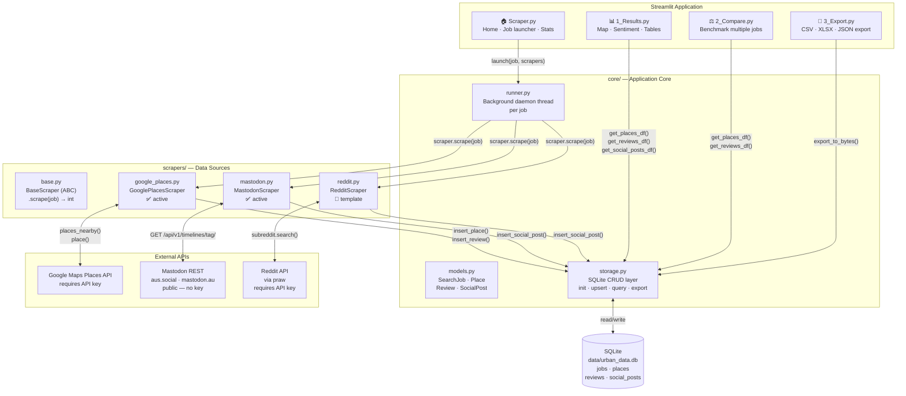
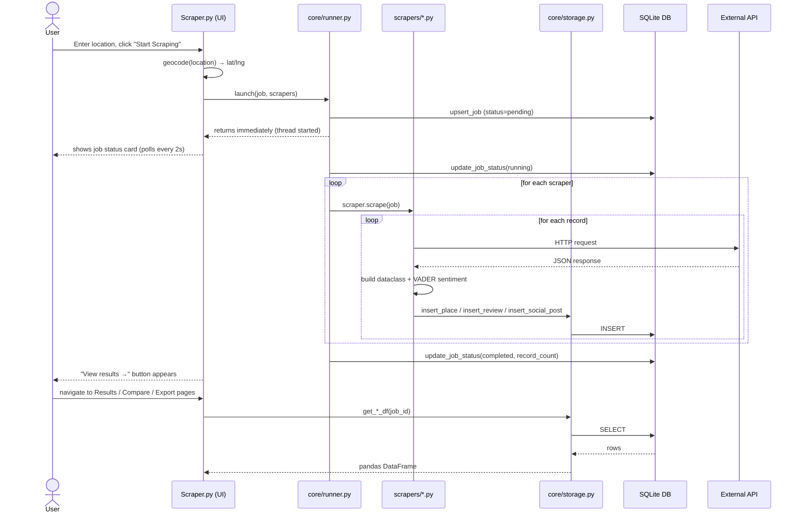
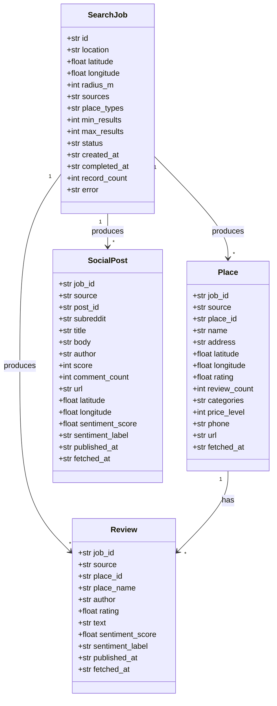
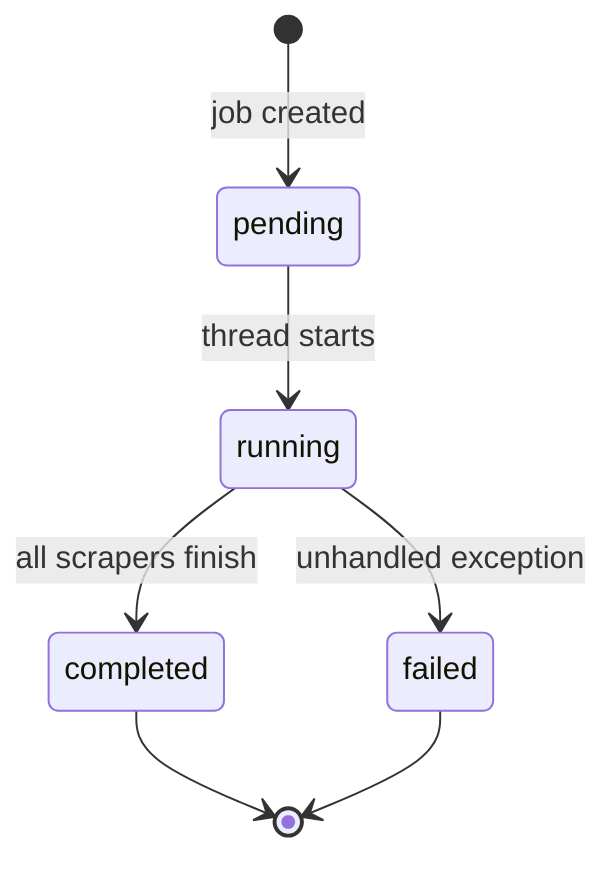
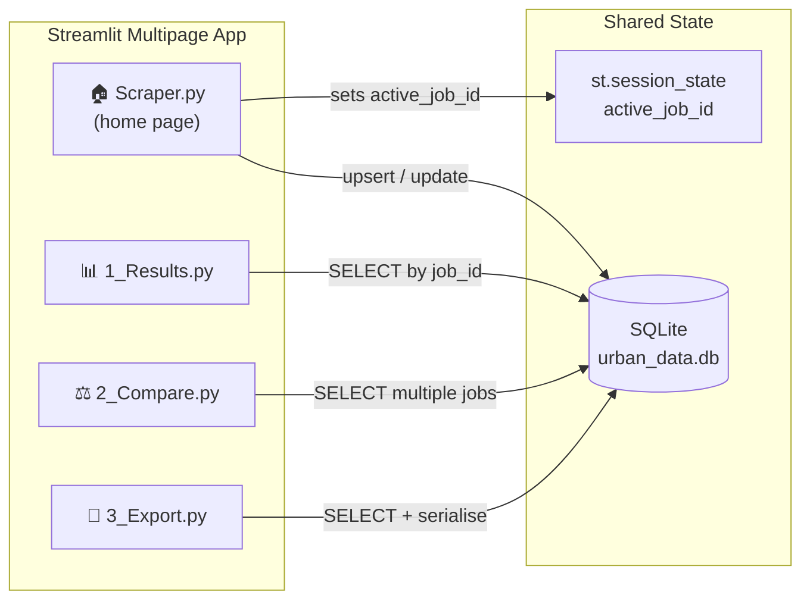
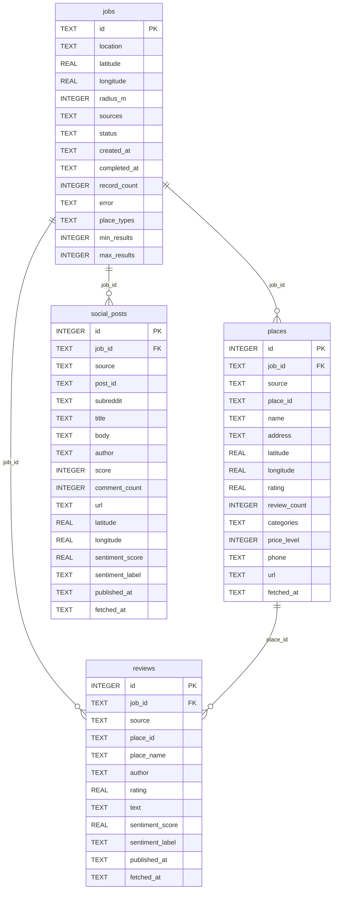

# Urban Data Scraper

A Streamlit-based research tool for collecting, analysing, and visualising urban place data and community discussions.  The scraper architecture is intentionally modular so you can understand it end-to-end and build your own data pipelines on top of it.

---

## Table of Contents

1. [Overview](#overview)
2. [System Architecture](#system-architecture)
3. [Project Structure](#project-structure)
4. [Quick Start](#quick-start)
5. [Configuration & API Keys](#configuration--api-keys)
6. [Scraper Architecture](#scraper-architecture)
7. [Dashboard Architecture](#dashboard-architecture)
8. [Database Schema](#database-schema)
9. [Building a New Scraper](#building-a-new-scraper)
10. [Extending the Dashboard](#extending-the-dashboard)
11. [Data Export](#data-export)

---

## Overview

Urban Data Scraper is a **single-application** research tool: the Streamlit UI, background scraping threads, and SQLite database all run in one process on your local machine.  There is no separate server to configure.

**What it collects:**

| Source | Data type | Authentication |
|---|---|---|
| Google Places | Businesses, POIs, reviews, ratings | API key (paid, free tier available) |
| Mastodon | Public posts by hashtag | None — fully public API |
| Reddit | Subreddit posts | API key (free) — *template provided* |

---

## System Architecture

The diagram below shows every component and how data flows between them.



### Data flow — step by step



---

## Project Structure

```
urban_data_scraper/
│
├── run.py                      # ← START HERE: one-command launcher
├── Scraper.py                  # Streamlit home page + job launcher
├── utils.py                    # Design system, CSS, shared UI helpers
├── requirements.txt            # Python dependencies
├── pyproject.toml              # Package metadata (PEP 517/518)
├── .env                        # Your local API keys  ⚠️ do not share or commit
├── .env.example                # Template — copy to .env and fill in
│
├── core/                       # Application core (no UI code)
│   ├── __init__.py
│   ├── models.py               # Dataclasses: SearchJob, Place, Review, SocialPost
│   ├── storage.py              # SQLite persistence layer
│   └── runner.py               # Background thread job runner
│
├── scrapers/                   # Pluggable data-source connectors
│   ├── __init__.py
│   ├── base.py                 # Abstract base class: BaseScraper
│   ├── google_places.py        # Google Maps Places API  ✅ active
│   ├── mastodon.py             # Mastodon public API     ✅ active
│   └── reddit.py               # Reddit via PRAW         📝 template
│
├── pages/                      # Streamlit multipage app
│   ├── 1_Results.py            # Explore a single job
│   ├── 2_Compare.py            # Benchmark 2–4 jobs
│   └── 3_Export.py             # Download data
│
├── .streamlit/
│   └── config.toml             # Theme and server settings
│
└── data/                       # Created at runtime — not included in distribution
    └── urban_data.db           # SQLite database
```

---

## Quick Start

### Prerequisites

- Python 3.10 or newer
- A Google Maps Platform API key with the **Places API** enabled (see [API key setup](#google-maps-api-key))

### 1. Unzip and enter the project folder

```bash
cd urban_data_scraper
```

### 2. Add your API key

```bash
cp .env.example .env
# Open .env and set GOOGLE_MAPS_API_KEY=your_key_here
```

### 3. Launch

```bash
python3 run.py
```

`run.py` does everything automatically:

1. Checks your Python version (3.10+ required)
2. Installs all dependencies via `pip`
3. Creates the `data/` directory
4. Verifies your `.env` — copies `.env.example` if missing
5. Starts the Streamlit dashboard at [http://localhost:8501](http://localhost:8501)

**Optional flags:**

```bash
python3 run.py --install      # install / refresh dependencies only, then exit
python3 run.py --no-install   # skip pip install (useful when deps are already present)
```

---

## Configuration & API Keys

All secrets live in `.env` in the project root.  **Never commit or share this file** — it is listed in `.gitignore`.

```ini
# Required — Google Places scraping and location geocoding
GOOGLE_MAPS_API_KEY=your_google_maps_api_key_here

# Optional — only needed if you complete the Reddit scraper template
REDDIT_CLIENT_ID=your_reddit_client_id
REDDIT_CLIENT_SECRET=your_reddit_client_secret
REDDIT_USER_AGENT=UrbanDataScraper/1.0 by YourUsername
```

### Google Maps API key

1. Go to [Google Cloud Console → APIs & Services](https://console.cloud.google.com/apis/dashboard)
2. Create a new project (or select an existing one)
3. Enable: **Places API**, **Geocoding API**, **Maps JavaScript API**
4. Create an API key under **Credentials**
5. Optionally restrict the key to those three APIs

> **Note on billing:** Google Maps gives $200 of free credit per month.  A single scrape job covering a 1.5 km radius typically consumes < $1.

### Reddit API key

1. Go to [reddit.com/prefs/apps](https://www.reddit.com/prefs/apps)
2. Click **create another app**
3. Choose **script**, set redirect URI to `http://localhost:8080`
4. Copy the `client_id` (shown under the app name) and `client_secret`
5. Set `REDDIT_USER_AGENT` to any descriptive string

---

## Scraper Architecture

Understanding the scraper layer is the core learning objective of this project.

### The contract: `BaseScraper`

Every scraper inherits from `scrapers/base.py`:

```python
class BaseScraper(ABC):
    name: str = "base"           # identifies the source in the database

    @abstractmethod
    def scrape(self, job: SearchJob) -> int:
        """Execute scraping for *job*.  Returns number of records inserted."""

    def __call__(self, job: SearchJob) -> int:
        return self.scrape(job)
```

**The only rule:** implement `scrape(job)` and return the number of records you inserted.  Everything else is up to you.

### What a `SearchJob` contains

The `SearchJob` dataclass (`core/models.py`) carries all the parameters the user set in the UI:

| Field | Type | Description |
|---|---|---|
| `id` | `str` | UUID — tag every record you insert with this |
| `location` | `str` | Free-text location, e.g. `"Newtown, Sydney NSW"` |
| `latitude` | `float` | Geocoded latitude |
| `longitude` | `float` | Geocoded longitude |
| `radius_m` | `int` | Search radius in metres |
| `max_results` | `int` | Hard cap per source (0 = unlimited) |
| `min_results` | `int` | Soft minimum target (0 = off) |
| `place_types` | `str` | Comma-separated Google place type keys |

### Data models

Scrapers write to the database using three dataclasses:



**When to use which:**
- `Place` — any physical venue, business, or point of interest
- `Review` — a review or rating attached to a `Place`
- `SocialPost` — a post or discussion from a social platform (Mastodon, Reddit)

### Storage API

All database writes go through `core/storage.py`:

```python
storage.insert_place(place: Place)           # → places table
storage.insert_review(review: Review)        # → reviews table
storage.insert_social_post(post: SocialPost) # → social_posts table
```

The `job_id` on every record is what links data back to a specific scrape job and makes the dashboard filters work.

### Sentiment analysis with VADER

Both active scrapers use [VADER](https://github.com/cjhutto/vaderSentiment) (Valence Aware Dictionary and sEntiment Reasoner) — a rule-based model tuned for short social-media text:

```python
from vaderSentiment.vaderSentiment import SentimentIntensityAnalyzer

_vader = SentimentIntensityAnalyzer()

def _sentiment(text: str) -> tuple[float | None, str | None]:
    if not text or not text.strip():
        return None, None
    compound = _vader.polarity_scores(text)["compound"]
    label = "positive" if compound >= 0.05 else "negative" if compound <= -0.05 else "neutral"
    return round(compound, 4), label
```

The compound score ranges from **-1.0** (most negative) to **+1.0** (most positive).  The thresholds ±0.05 are VADER's recommended defaults.

### Background execution

`core/runner.py` wraps every set of scrapers in a Python daemon thread so the Streamlit UI stays responsive during long scrapes:



The home page polls job status every 2 seconds using Streamlit's `@st.fragment(run_every=2)` decorator and updates the status card live.

---

## Dashboard Architecture

The dashboard is a **Streamlit multipage application**.  Each `.py` file in `pages/` is automatically added to the sidebar.



### Pages

| Page | Purpose | Key features |
|---|---|---|
| **Scraper.py** | Home — job launcher and overview | Geocoding, source selection, place type picker, live job status, records-by-source chart, recent jobs table |
| **1_Results.py** | Explore a single completed job | Folium map, sentiment pie chart, per-source tabs, filterable data tables, row-level deletion |
| **2_Compare.py** | Benchmark 2–4 jobs side by side | Volume bar charts, avg rating comparison, sentiment mix, top-rated places per location |
| **3_Export.py** | Download scraped data | Job history table, source breakdown, multi-job export to CSV / XLSX / JSON |

### Shared design system (`utils.py`)

All pages import from `utils.py` which provides:

- **Palette constants** (`LIME`, `INK`, `MUTED`, `DARK`, …) — change once, updates everywhere
- **`SOURCE_CONFIG`** — per-source colours, icons, and labels used in charts and badges
- **`inject_css()`** — injects the "Soft Glass" design system CSS into every page
- **`style_plotly(fig)`** — applies consistent Plotly chart theming
- **`source_badge(key)`** — renders a coloured pill for a source name

---

## Database Schema

The SQLite database at `data/urban_data.db` has four tables.



**Design notes:**
- All rows carry `job_id` so you can isolate any job's data or delete it entirely
- `social_posts.subreddit` stores a channel/hashtag identifier regardless of platform (e.g. `"r/sydney"` for Reddit, `"#newtown@aus.social"` for Mastodon)
- The schema is auto-migrated in `storage.init_db()` — older databases gain new columns automatically

---

## Building a New Scraper

The Reddit scraper in `scrapers/reddit.py` is a fully documented template.  Follow these five steps to wire in any new data source.

### Step 1 — Inherit from `BaseScraper`

```python
# scrapers/my_source.py
from scrapers.base import BaseScraper
from core.models import SearchJob, SocialPost   # or Place, Review
import core.storage as storage

class MySourceScraper(BaseScraper):
    name = "mysource"   # used as the `source` column in the database

    def __init__(self) -> None:
        # Initialise your API client here.
        # Raise EnvironmentError if required keys are missing.
        pass

    def scrape(self, job: SearchJob) -> int:
        # Fetch data, build dataclasses, insert, return count.
        return 0
```

### Step 2 — Read API credentials from `.env`

```python
import os
from dotenv import load_dotenv

load_dotenv()

api_key = os.getenv("MY_SOURCE_API_KEY", "")
if not api_key:
    raise EnvironmentError("MY_SOURCE_API_KEY is not set in .env")
```

### Step 3 — Build and insert records

For social platforms use `SocialPost`; for businesses use `Place` + `Review`.

```python
from vaderSentiment.vaderSentiment import SentimentIntensityAnalyzer
_vader = SentimentIntensityAnalyzer()

def _sentiment(text):
    c = _vader.polarity_scores(text)["compound"]
    return round(c, 4), ("positive" if c >= 0.05 else "negative" if c <= -0.05 else "neutral")

# Inside scrape():
post = SocialPost(
    job_id=job.id,          # ← always tag records with the job id
    source=self.name,
    post_id="unique-id",
    subreddit="r/example",
    title="Post headline",
    body="Full text…",
    author="username",
    score=42,
    comment_count=7,
    url="https://…",
    sentiment_score=s_score,
    sentiment_label=s_label,
    published_at="2024-01-01T00:00:00",
)
storage.insert_social_post(post)
count += 1
```

### Step 4 — Register it in `Scraper.py`

Open `Scraper.py` and add your scraper to `_build_scrapers()`:

```python
mapping = {
    "Google Places": ("scrapers.google_places", "GooglePlacesScraper"),
    "Mastodon":      ("scrapers.mastodon",       "MastodonScraper"),
    "My Source":     ("scrapers.my_source",      "MySourceScraper"),  # ← add this
}
```

Then add a checkbox in the "Data sources" section:

```python
use_mine = sc3.checkbox("🔵 My Source", value=False)
selected_sources = (
    ...
    + (["My Source"] if use_mine else [])
)
```

### Step 5 — Add a colour to `utils.py`

```python
SOURCE_CONFIG: dict = {
    "google":   {"label": "Google Places", "icon": "📍", "color": "#0E7C5A", "soft": "#D4F3E5"},
    "mastodon": {"label": "Mastodon",      "icon": "🐘", "color": "#6364FF", "soft": "#ECEEFE"},
    "mysource": {"label": "My Source",     "icon": "🔵", "color": "#2563EB", "soft": "#DBEAFE"},
}
```

Your data will now appear in the Results, Compare, and Export pages automatically.

### Complete the Reddit template

`scrapers/reddit.py` has three clearly marked `# TODO` sections:

| TODO | What to do |
|---|---|
| **TODO 1** | Initialise the PRAW Reddit client using `.env` credentials |
| **TODO 2** | Map a PRAW `Submission` object to a `SocialPost` dataclass |
| **TODO 3** | Loop over subreddits, search for posts, insert results |

Each TODO includes the complete working implementation as commented-out code — read, uncomment, and adapt.

---

## Extending the Dashboard

### Add a new analysis page

Create `pages/4_MyPage.py`.  Streamlit automatically adds it to the sidebar.

```python
import streamlit as st
import core.storage as storage
from utils import inject_css

st.set_page_config(page_title="My Page", page_icon="🔬", layout="wide")
inject_css()

jobs = storage.get_all_jobs()
selected = st.selectbox("Job", [j["id"] for j in jobs])
df = storage.get_social_posts_df(job_id=selected)
st.dataframe(df)
```

### Add a new column to the database

1. Add the column to the `CREATE TABLE` statement in `core/storage.py → init_db()`
2. Add a migration guard in the `PRAGMA table_info` block below it:
   ```python
   for col, ddl in (..., ("my_column", "TEXT")):
       if col not in existing:
           conn.execute(f"ALTER TABLE social_posts ADD COLUMN {col} {ddl}")
   ```
3. Update `insert_social_post()` to pass the new value

---

## Data Export

The **Export** page (`pages/3_Export.py`) lets you download data for any combination of jobs and sources.

| Format | Contents |
|---|---|
| **CSV** | All three tables concatenated, with a `_table` column to distinguish them |
| **XLSX** | Three sheets: `places`, `reviews`, `social_posts` |
| **JSON** | `{ "places": [...], "reviews": [...], "social_posts": [...] }` |

You can also call the export function programmatically:

```python
import core.storage as storage

raw = storage.export_to_bytes(job_id="your-job-uuid", fmt="csv")
with open("export.csv", "wb") as f:
    f.write(raw)
```

---

## Licence

MIT — free to use, modify, and distribute for educational purposes.
